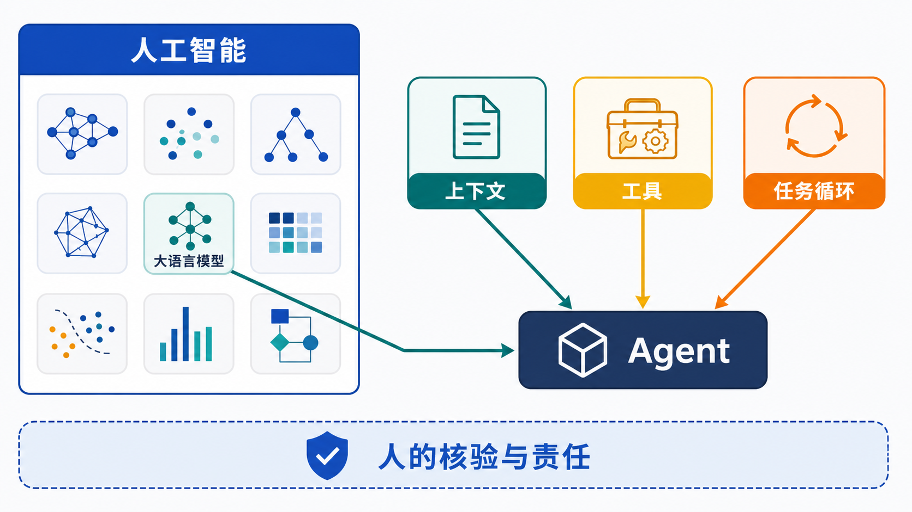
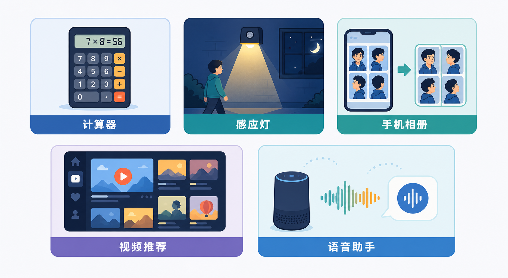
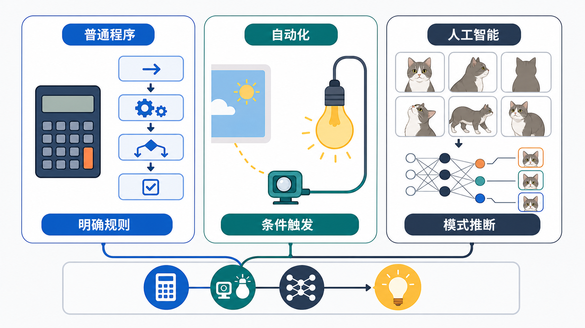
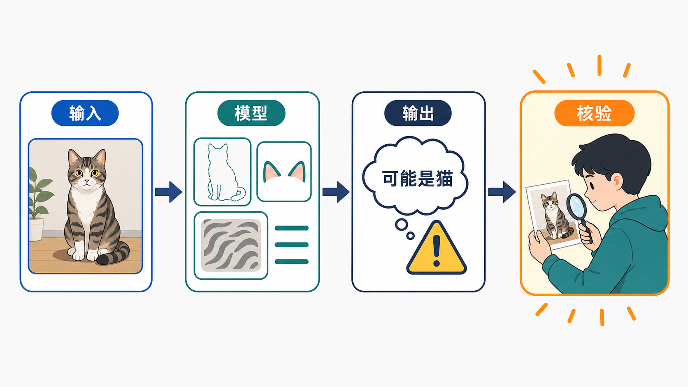
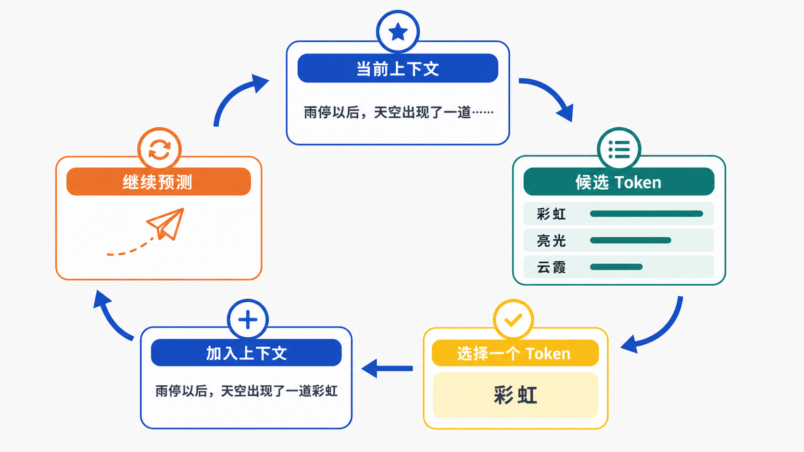
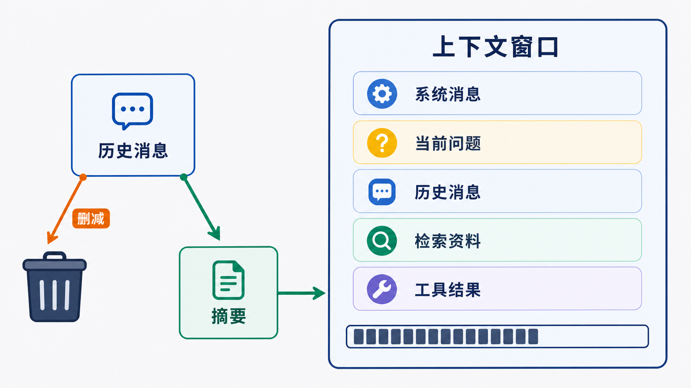
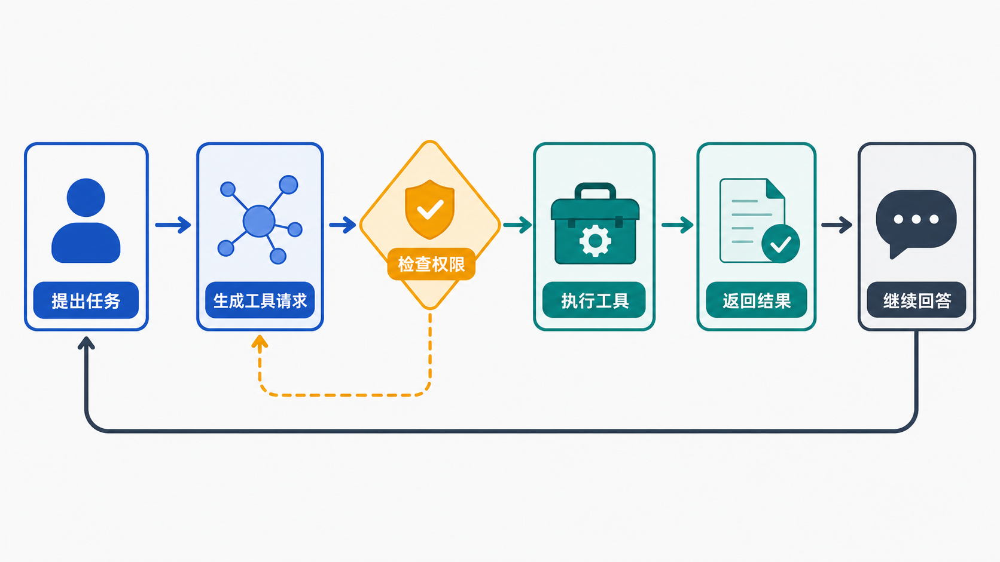
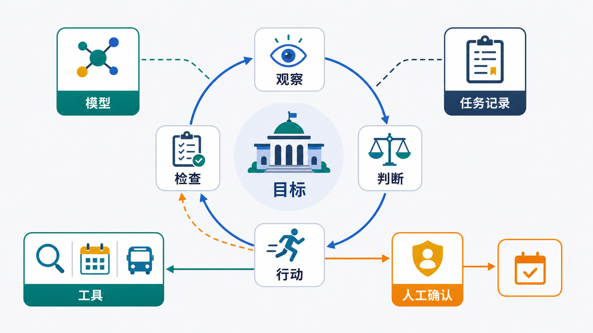
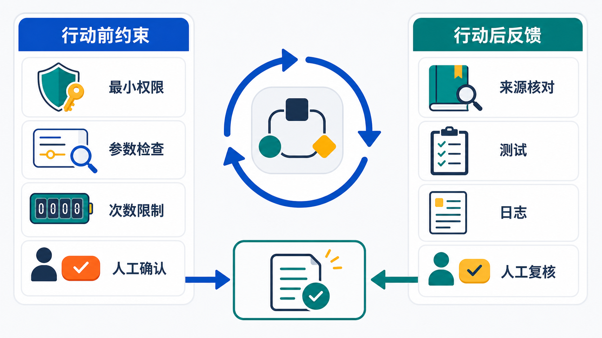
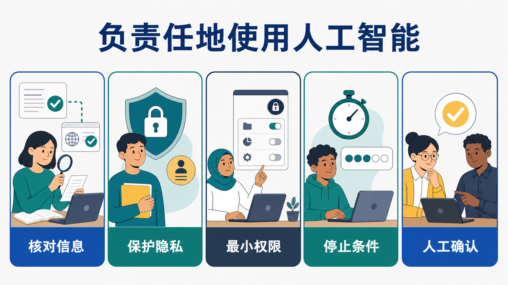

# 认识人工智能

手机相册会自动整理照片，视频平台会推荐内容，聊天助手还能写文章、查资料、改代码。它们看上去都很“聪明”，但背后做的事并不一样。

这一章不堆概念，也不把人工智能说成魔法。我们只顺着一条主线，把 **AI、大语言模型、工具、Agent，以及人怎样把关** 讲清楚。

## 先看全章地图

### 先记住这条主线

**人工智能是一个很大的领域，大语言模型是其中一类模型。许多现代 Agent，都是由应用把大语言模型、上下文、工具和任务循环组织在一起形成的。**

### 这一章只回答六个问题

1. 会自动工作的程序，都算人工智能吗？
2. 大语言模型怎样一点点生成回答？
3. 上下文决定了模型此刻能参考什么？
4. 模型怎样通过工具查询信息或执行动作？
5. Agent 怎样把这些能力连成一个多步任务？
6. 人怎样核验结果、限制权限并承担最终责任？

> [!NOTE]
> 本章适合小学高年级、初中和高中学生。预计阅读 30—40 分钟，也可以分成两次阅读。

## 先从身边的 AI 说起

### 会自动工作，不一定用了 AI

计算器能自动算出 `7 × 8 = 56`，感应灯能在有人经过时亮起来。它们都会自动工作，但通常只是按照人提前写好的规则运行。

手机相册识别同一个人、视频平台猜你想看什么，面对的输入变化要多得多。它们往往要根据数据中学到的模式做推断，而且不保证每次都对。

### 抓住三个词：规则、触发、推断

| 方式     | 一句话理解             | 例子                 |
| -------- | ---------------------- | -------------------- |
| 普通程序 | 按照明确规则一步步计算 | 计算器、密码长度检查 |
| 自动化   | 条件被触发，就自动行动 | 定时浇水、感应灯     |
| 人工智能 | 根据学到的模式进行推断 | 图像识别、内容推荐   |

这三种方式不是互相排斥的。一项 AI 功能仍然需要普通程序读取输入、显示界面，也可能由自动化规则触发。

### 看功能，不要急着给整台设备贴标签

一台智能空调可能用普通程序显示温度，用自动化规则控制开关，再用 AI 预测使用习惯。

所以，与其问“这台设备是不是 AI”，不如问得更准：**它的哪一个功能用了 AI？这一步是怎样得到结果的？**

## AI 系统怎样得到结果

### 最基本的路线：输入—模型—输出—核验

不管是识别照片，还是生成文字，都可以先用四步看懂：

1. **输入：** 系统收到了什么？可能是照片、声音、文字或传感器数据。
2. **模型：** 系统用训练形成的参数和计算结构，在输入中寻找相关模式。
3. **输出：** 系统给出分类、预测、推荐，或者新生成的内容。
4. **核验：** 人或外围程序检查结果是否合理，再决定怎样使用。

模型输出的是根据当前信息做出的推断。界面上只显示一个答案，不等于它有百分之百的把握。

### 训练模型和使用模型，是两件事

训练时，模型会处理大量示例，内部参数也会不断调整。可以先粗略理解成：**通过很多示例学习模式。**

使用时，系统拿已经训练好的模型处理眼前的输入。一次普通对话，通常不会让模型当场重新训练，也不等于模型已经把这段话永久记住。

> [!WARNING]
> 数据多，不等于数据一定好。训练数据有错误、缺少重要场景，或者不能代表不同人群，模型的结果也可能不准确或不公平。

### 大语言模型只是 AI 的一种

AI 是一个大领域。识别道路标志的视觉模型、预测降雨的模型和大语言模型，都可以属于 AI，但它们处理的信息和任务不同。

接下来重点讲大语言模型，是因为今天很多聊天助手和 Agent 都以它为核心，不是因为“所有 AI 都是大语言模型”。

## 大语言模型怎样生成回答

大语言模型通常简称 LLM，也就是 Large Language Model。它从大量语言示例中学习模式，可以处理提问、写作、摘要、翻译和代码等内容。

如果只抓住最核心的生成机制，一句话就够了：**根据当前上下文，预测下一个 Token。**

### Token：模型处理内容的小单位

我们看到的是句子，模型处理的则是一串 Token。

Token 可能是一个汉字、一个词的一部分、一个标点，也可能是空格和符号的组合。不同模型的切分方式可能不同，所以不要死记“一个 Token 就是一个字”。

### 核心机制：预测下一个 Token

大语言模型生成内容时，会根据当前上下文计算下一个 Token 的可能性，选择一个 Token 加进去，然后继续预测。

例如，已有内容是“雨停以后，天空出现了一道……”。模型会根据当前内容，给“彩虹”“亮光”等候选 Token 计算不同的可能性。

假设这一轮选了“彩虹”，新的上下文就变成“雨停以后，天空出现了一道彩虹……”。模型再根据这个新上下文预测下一个 Token。

### 完整回答，就是这个循环重复很多次

把过程压缩一下，就是：

**读取当前上下文 → 计算候选 Token 的可能性 → 选择一个 Token → 加入上下文 → 再来一次**

循环会在模型生成结束标记、达到长度限制，或者程序要求停止时结束。对最基本的生成过程来说，它不是先在某个资料库里找到一整段固定答案，再原样取出来。

### 为什么同一个问题，回答会变？

生成程序不一定每次都选可能性最高的 Token。它也可以在几个较合适的候选中做选择，让表达不那么单一。

换了模型、上下文或工具结果，回答可能不同；即使这些都一样，生成时选到不同的 Token，回答也可能变化。变化本身不代表模型突然变聪明了，也不代表它一定变差了。

### 说得顺，不等于说得对

预测“接下来什么内容更可能出现”，和判断“现实中什么一定为真”，是两个不同的问题。

模型可能把不完整的信息连成一段听起来很合理的回答，也可能混淆人物、日期和来源。语句通顺只能说明表达连贯，不能代替事实核验。

> [!NOTE]
> 大语言模型生成文字的方式和人的理解方式不同。它能完成复杂任务，不代表它拥有人的生活经验、情感或意识。

## 上下文决定模型此刻能参考什么

### 上下文，就像此刻摆在桌面上的资料

模型生成下一个 Token 时，要看当前上下文。可以先把上下文想成一张工作桌：桌面上放着什么，模型此刻就能参考什么。

应用可能把这些内容放进当前上下文：

- **系统消息：** 说明任务、回答方式和使用边界；
- **用户消息：** 你刚刚提出的问题和要求；
- **助手消息：** 被应用保留下来的之前回答；
- **其他资料：** 检索到的文档、工具结果和当前任务记录。

应用会按照模型需要的格式整理这些消息，再交给模型。聊天界面上看到的样子，不一定就是模型最后收到的原始格式。

### 指令会影响回答，但不是安全护墙

系统消息可以告诉模型“你要做什么”“用什么语气回答”“有哪些工具”。指令训练也能让模型更擅长回应要求，而不只是继续补全文字。

但模型仍可能误解或没有正确遵循指令。删除、付款、发送信息等重要限制，不能只写在一句提示词里，还要由权限和控制程序真正拦住。

### 上下文窗口有容量限制

模型一次能处理的 Token 数量有上限，这个范围叫作上下文窗口。窗口再大，也不是无限空间。

对话太长时，应用可能删掉较早的消息，或者先把它们压缩成摘要。摘要能保留主要内容，也可能丢掉细节。

所以，长对话里的“忘记”往往是上下文管理的结果，不是模型像人一样主动遗忘。

### 上下文不等于永久记忆

开启新对话时，应用通常会建立新的上下文。旧对话里的信息，不会天然出现在新对话里。

有些应用会另外保存偏好、摘要或任务记录，下次再放回上下文。这是外围应用实现的记忆功能，不是模型天然、永久地记住了你。

## 工具让模型从“会回答”到“能行动”

### 模型不会凭空看到实时世界

如果你问“科学馆这周六几点开门”，模型在训练中学到的信息不一定是最新的。要查官方网站，它需要应用提供的搜索或网页读取工具。

同样，读取文件、查询天气、调用计算器进行精确计算和发送消息，都是外部工具真正执行的动作。模型通常负责提出请求，不是亲自伸手操作。

### 一次工具调用，到底发生了什么？

1. 应用先把可用工具的名称、用途和参数规则告诉模型。
2. 模型根据任务，生成“使用哪个工具、带什么参数”的请求。
3. 控制程序检查工具、参数和权限，决定是否允许执行。
4. 工具真正运行，返回数据、状态，也可能返回报错或空结果。
5. 应用把结果加入当前上下文，模型再继续回答或决定下一步。

一句话总结：**模型生成调用请求，程序检查并执行，工具结果再回到上下文。**

> [!NOTE]
> “工具”是系统拥有的一种能力；“行动”是某一轮真正要做的事。有工具，不等于每一轮都要使用它。

### 为什么一定要检查权限？

模型可能选错工具、填错参数，也可能误解你的目标。而且，“查看公开网页”和“删除文件”的风险完全不同。

安全的做法是：只给完成任务真正需要的权限；删除、付款、发布、发送信息等重要操作，执行前再让人确认。

## Agent 怎样完成多步任务

### 先看一个完整任务

假设你说：“帮我整理一份周六去科学馆的参观计划。”

这不是一次搜索就能结束的任务。系统可能要先找官方网站，再核对开放时间和预约要求，接着查交通，最后整理成一份带来源的计划。

每一步都会产生新结果。下一步怎么做，要看上一步实际找到了什么，而不是一开始就假装所有答案都已经知道。

### 什么是 Agent？

Agent 中文常译为“智能体”。这里说的不是有意识的电子人，而是一种完成任务的 AI 系统。

> **Agent 是一个围绕目标工作的 AI 应用。它通常把模型、任务状态、可用工具和控制程序组合起来，根据中间结果连续完成多个步骤。**

Agent 不是“更聪明的 LLM”的另一个名字。LLM 是模型；Agent 是围绕任务组织起来的整个系统。

### 一个 Agent 要把哪些部分组织起来？

- **目标：** 现在到底要完成什么；
- **模型：** 理解当前信息，判断下一步；
- **任务记录：** 保留已知信息、工具结果和当前进度；
- **工具：** 查询资料或执行允许的动作；
- **控制程序：** 执行请求、检查权限、处理错误，并决定何时停止。

不同产品会有不同设计。这五项是一张入门检查表，不是所有 Agent 必须照抄的固定配方。

### 核心循环：观察—判断—行动—检查

1. **观察：** 读取目标、当前进度和上一步结果。
2. **判断：** 根据现有信息，选择下一个合适步骤。
3. **行动：** 需要工具时，模型提出调用请求，控制程序检查并执行；不需要工具时，也可以直接给出结果或结束任务。
4. **检查：** 看结果是否有用、是否离目标更近，再决定结束、修正还是进入下一轮。

工具返回的不一定是成功数据，也可能是报错、空结果或状态变化。这些结果会进入当前任务上下文，成为下一轮判断的新信息，不会自动改变模型参数。

> [!NOTE]
> **ReAct** 是一种让推理与行动交替进行的方法，常用 **Thought—Action—Observation** 表示它的循环：判断下一步、执行动作、读取结果，再进入下一轮。英文名称不是重点，过程才是重点。

### Agent 不能没完没了地跑下去

一个可控的 Agent 必须有停止出口：任务完成时停止，连续报错或达到次数限制时停止，遇到信息不足或高风险动作时交给人。

这很重要。多步任务里，前面的一个小错误，可能让后面每一步都越走越偏。

### Agent 和 Workflow（工作流），不用硬分成两个阵营

Workflow 的主要路线由开发者提前设计，行为更容易预测。Agent 可以根据中间结果灵活选择下一步，但也更可能跑偏。

真实产品常常两者混合：大路线由 Workflow 管住，只在需要灵活判断的小环节使用 Agent。能用明确规则稳定完成的事，没有必要为了看起来“更智能”而增加不确定性。

### 这些拓展词，先认识，不用现在背

- **MCP（模型上下文协议）：** 让 AI 应用更容易按共同规则连接工具和资料；它不是工具本身，也不会自动保证安全。
- **RAG（检索增强生成）：** 先从外部资料中检索相关片段，再把它们放进上下文辅助生成。
- **长期记忆：** 由外围应用保存经过选择的偏好、摘要或记录，以后需要时再提供给模型。
- **Skills（技能）：** 在一些产品中，指可重复使用的任务说明、示例、资源或脚本组合；这个词没有跨所有产品的统一定义。

这些都是应用可以选择的能力或设计，不是每个 Agent 都必须全部拥有的“四件套”。

## 能力越强，越要看清边界

### AI 比较擅长什么？

AI 擅长从大量信息中寻找模式，也能完成识别、预测、推荐和生成等任务。有了合适的工具和清楚的边界，Agent 还可以帮人搜集资料、整理草稿和处理多步任务。

但“能做”不等于“每次都能做对”，更不等于“可以不受限制地做”。

### 错误可能从好几个地方进来

- 输入含糊，或上下文缺少关键信息；
- 模型生成了流畅却不正确的内容；
- 检索到的资料过期，或工具返回错误结果；
- Agent 误解目标，让多个步骤沿着错误方向继续。

让模型自己说“我检查过了”，不算可靠证明。它仍然可能重复原来的错误。

### 把这五条安全线留给自己

1. **核对信息：** 重要事实查可靠来源，日期、政策和数据还要看是否最新。
2. **保护隐私：** 不随意输入住址、账号密码、身份证明，也不上传包含他人隐私的文件。
3. **只给必要权限：** 能只读就不给修改权限，删除、付款、发布等动作执行前要再确认。
4. **设置停止条件：** 限制次数、时间和资源，不让 Agent 无限循环。
5. **人做最终决定：** 医疗、安全、权益等重要事情，要交给可信赖的成年人或专业人员复核。

### 会说“我”，不等于拥有人的意识

模型可以说“我认为”“我理解”，也能写出看似有计划的步骤。这首先说明它学会了相应的语言和任务模式，不能据此证明它拥有人的感受、生活经验或自由意志。

能力强和有意识是两个问题。尊重技术的能力，也要看清它的工作方式和边界。

## 回到开头那张图

现在，开头的主线可以用五句话重新讲一遍：

1. **AI 是大领域：** 它常常根据从数据中学到的模式进行推断，而自动运行不一定就是 AI。
2. **LLM 逐个生成 Token：** 它根据当前上下文预测下一个 Token，再一步步组成回答。
3. **上下文像当前工作桌：** 它决定模型这一次能直接读取哪些消息和任务资料。
4. **工具由程序执行：** 模型提出请求，控制程序检查权限并执行，结果再回到上下文。
5. **Agent 把步骤连起来：** 它根据中间结果循环工作，但必须受到权限、停止条件和人的确认约束。

> [!TIP]
> 如果只记一句：**LLM 负责根据上下文生成内容，工具负责执行外部动作，Agent 负责把它们组织成多步任务，人负责设定边界和确认结果。**

## 参考资料

- [OECD：人工智能系统的定义](https://oecd.ai/en/wonk/definition)——支持人工智能系统“输入—推断—输出”等基础概念。
- [OECD：人工智能如何工作](https://oecd.ai/en/inside-artificial-intelligence)——用于核对机器学习、数据、模型与推断的基础说明。
- [Hugging Face Agents Course：What are LLMs?](https://huggingface.co/learn/agents-course/en/unit1/what-are-llms)——用于核对 Token、逐 Token 生成和 LLM 在 Agent 中的作用。
- [Hugging Face Agents Course：Messages and Special Tokens](https://huggingface.co/learn/agents-course/en/unit1/messages-and-special-tokens)——用于核对系统、用户和助手消息怎样成为模型输入。
- [Hugging Face Agents Course：What are Tools?](https://huggingface.co/learn/agents-course/en/unit1/tools)——用于核对工具描述、工具调用和 MCP 的基本定位。
- [Hugging Face Agents Course：What is an Agent?](https://huggingface.co/learn/agents-course/en/unit1/what-are-agents)——用于核对 Agent 的定义、行动能力和任务范围。
- [Hugging Face Agents Course：Agent steps and structure](https://huggingface.co/learn/agents-course/en/unit1/agent-steps-and-structure)——用于核对 Thought—Action—Observation 循环。
- [Google for Developers：大语言模型简介](https://developers.google.com/machine-learning/crash-course/llm)——用于核对大语言模型、Token 和生成机制的基础描述。
- [Model Context Protocol：Introduction](https://modelcontextprotocol.io/docs/getting-started/intro)——用于核对 MCP 的定位与用途。
- [NIST：人工智能风险管理框架](https://www.nist.gov/itl/ai-risk-management-framework)——用于核对可靠性、风险管理和人类监督等原则。
- [UNESCO：学生人工智能能力框架](https://www.unesco.org/en/articles/ai-competency-framework-students?hub=195885)——用于设计面向学生的人工智能素养目标。
- [UNESCO：人工智能伦理建议书](https://www.unesco.org/en/articles/recommendation-ethics-artificial-intelligence?hub=66927)——支持隐私、公平、人类监督和负责任使用等内容。
- [Labuladong：LLM 和 Agent 的核心术语和原理](https://labuladong.online/zh/ai-coding/basics/llm-and-agent/)——作为术语组织和讲解层级的参考，正文采用独立结构与原创表达。
