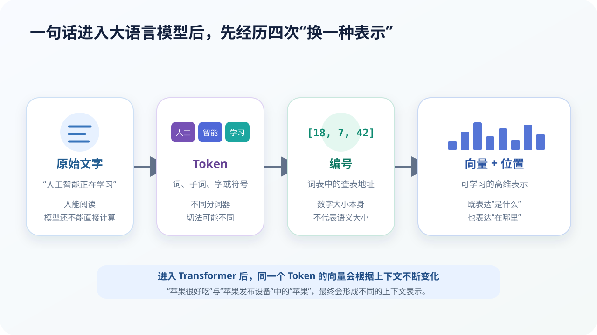

# 文字怎样变成 Token 与向量：从字符到可计算表示

## 本课目标

- 解释 Token、词表、Token ID 和嵌入向量；
- 理解为什么不同模型会用不同分词方式；
- 知道位置和上下文会改变 Token 的最终表示。

## 模型不能直接“读”汉字

计算机最终只能处理数字。文字进入语言模型后，大致经历：

> **文字 → Token → Token ID → 嵌入向量 + 位置信息 → Transformer**

## Token 是什么

Token 是语言模型处理序列的基本单位。它可能是：

- 一个常见词；
- 一个汉字；
- 英文单词的一部分；
- 标点、空格或换行；
- 代码符号；
- 特殊控制标记。

为什么不把每个完整词都放进词表？因为新名字、新术语、不同词形和多种语言会让词表无限膨胀。子词分词在“词表不能太大”和“任何文字都能拆开”之间取得平衡。

### 同一句话可能被不同模型切得不同

“机器学习真有趣”可能被切成：

- `机器` / `学习` / `真` / `有趣`
- `机` / `器` / `学` / `习` / `真` / `有` / `趣`
- 或其他组合。

分词取决于词表、训练语料、规范化方式和分词算法。Token 数会影响上下文占用、速度与费用，但 Token 不是稳定的“字数换算单位”。

## 规范化与预分词

真正切分前，分词器还可能：

- 统一某些 Unicode 表示；
- 处理大小写；
- 划分空格和标点；
- 保留或转换换行、缩进；
- 加入对话角色或图片占位等特殊 Token。

这些步骤会影响模型看到的输入。对于代码、数学符号和多语言文字，过度规范化可能丢失重要信息，因此不同模型选择不同策略。

## Token ID 只是查表地址

分词器的词表会为每个 Token 分配整数编号。例如：

| Token | 示意编号 |
| --- | ---: |
| 人工 | 1821 |
| 智能 | 734 |
| 学习 | 965 |

“编号 1821”不比“编号 734”更重要，也没有天然距离意义。它只是让系统在嵌入表中找到对应向量。

## 嵌入向量把离散符号变成可学习表示

嵌入层把每个 ID 转换为一串数字。例如一个 Token 可能对应几千维向量。向量的每一维通常没有简单的人类词典解释，但整体几何关系可以编码用法、语义和语法模式。

初始嵌入进入网络后还会反复变化。经过多层注意力和前馈网络，同一个 Token 会融入当前上下文。

例如“苹果”：

- “我吃了一个苹果”会与“吃、一个”等信息结合；
- “苹果发布了一款设备”会与“发布、设备”等信息结合。

因此，现代模型使用的是**上下文化表示**，不是给每个词永远固定一个含义。

## 为什么要加入位置信息

下面两句拥有相似 Token，含义却不同：

> 小猫追小狗。  
> 小狗追小猫。

如果模型只知道有哪些 Token，却不知道顺序，就不能判断谁追谁。Transformer 会加入位置编码或旋转位置表示等信息，使模型能够区分位置并估计相对距离。

位置方法影响模型处理长序列的方式。上下文长度增加，也不保证模型能同样准确地使用每个位置的信息。

## Token 化会带来哪些实际影响

### 多语言效率差异

同样意思在不同语言中可能占用不同 Token 数。词表对某类语言覆盖不足时，文字会被切得更碎，增加计算成本并可能影响表现。

### 生僻词与专有名词

新名字通常能被拆成更小片段，所以不至于完全“无法输入”。但切分过碎会让模型更难稳定表示其含义。

### 提示词长度

系统指令、历史对话、上传材料、工具结果和模型输出都会占用上下文 Token。超过窗口后，系统需要截断、总结或检索。

### 字符不等于 Token

不能用“一个汉字一定等于一个 Token”“一个英文单词一定等于一个 Token”做精确估算。必须使用对应模型的分词器检查。

## 小活动：设计一个分词器

把下面三句分别按“逐字”“按词”“子词混合”切分：

1. 人工智能正在改变学习方式。
2. unbreakable models learn patterns.
3. `getUserProfile(userId)`

比较：

- 哪种切法词表最小？
- 哪种序列最短？
- 遇到新词时哪种最稳妥？
- 代码中的大小写和括号能否丢掉？

## 本课小结

- Token 是模型处理序列的单位，不固定等于字或词；
- Token ID 只是查表地址；
- 嵌入把离散符号转换为高维可学习表示；
- 位置信息帮助模型理解顺序；
- 上下文中的计算会让相同 Token 形成不同表示。

## 参考资料

- [Google：Introduction to Large Language Models](https://developers.google.com/machine-learning/crash-course/llm)
- [Hugging Face：Normalization and pre-tokenization](https://huggingface.co/learn/llm-course/en/chapter6/4)
- [Hugging Face：Tokenizers](https://huggingface.co/docs/tokenizers/index)

