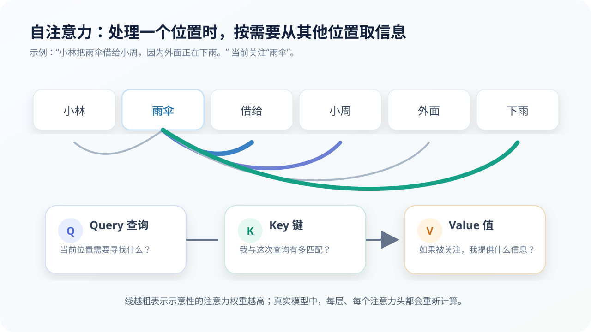

# 注意力与 Transformer：一句话里的信息怎样相互联系

## 本课目标

- 直观解释自注意力；
- 理解 Query、Key、Value 和多头注意力；
- 认识 Transformer 一层中的主要结构与局限。

## 为什么顺序处理不够

RNN 会把历史状态一步步传下去，但很长句子中，早期信息可能变弱；顺序计算也限制了大规模并行。

Transformer 提出另一条路线：让序列中不同位置直接计算关联，再按相关程度汇总信息。2017 年的《Attention Is All You Need》最初用于机器翻译，后来成为现代大语言模型的重要基础。

## 自注意力在问什么

处理每个 Token 时，自注意力都会计算：

> 当前这个位置，应该从其他哪些位置取多少信息？

例如：

> 小林把雨伞借给小周，因为外面正在下雨。

处理“雨伞”时，“借给”“小周”“下雨”可能提供不同信息。下一层或另一个注意力头会重新计算，关系并非永久固定。

## Query、Key 和 Value

每个 Token 的当前表示通过三组线性变换得到：

- **Query（查询）：**我现在需要寻找什么信息？
- **Key（键）：**我能与哪类查询匹配？
- **Value（值）：**如果被关注，我提供什么内容？

简化计算可写成：

$$
\operatorname{Attention}(Q,K,V)=\operatorname{softmax}\left(\frac{QK^T}{\sqrt{d_k}}\right)V
$$

不用背公式，只要抓住三步：

1. Query 与所有 Key 计算匹配分数；
2. softmax 把分数变成权重；
3. 按权重对 Value 加权汇总。

除以 (\sqrt{d_k}) 是为了让数值尺度更稳定。

## 为什么要多头注意力

一句话中可能同时存在：

- 谁执行动作；
- 动作作用于谁；
- 代词指向哪个名词；
- 前后是否转折；
- 代码变量在哪里定义和使用；
- 某个格式是否在远处闭合。

多头注意力让模型在不同表示子空间中并行寻找关系。不能保证某个头永远负责“语法”或“指代”，但多个头联合通常比单一视角更有表达力。

## 一层 Transformer 还包含什么

注意力不是 Transformer 的全部。典型一层还包括：

- **前馈网络（MLP）：**对每个位置的表示进一步非线性变换；
- **残差连接：**让原信息与新变换相加，帮助深层训练；
- **归一化：**稳定不同层之间的数值；
- **因果遮罩：**生成模型训练时禁止当前位置偷看未来 Token。

多层堆叠以后，每个 Token 表示会反复汇总上下文、变换和重组。

## 编码器、解码器和仅解码器模型

原始 Transformer 同时有编码器和解码器：编码器理解输入，解码器生成输出。后来形成不同路线：

- **仅编码器：**擅长理解、分类与生成表示；
- **编码器—解码器：**适合翻译、摘要等输入到输出任务；
- **仅解码器：**根据已有上下文自回归生成，是许多聊天式 LLM 的基础。

## 标准注意力的代价

如果序列有 (N) 个 Token，标准全注意力需要考虑许多两两关系，计算与内存通常随 (N^2) 增长。上下文翻倍，相关开销可能增长约四倍。

因此长上下文系统会使用：

- KV 缓存减少重复计算；
- 局部、稀疏或分块注意力；
- 更高效的注意力实现；
- 检索系统只取回相关资料；
- 对历史信息进行压缩或总结。

## 注意力权重不等于完整解释

权重图可以展示某一层、某个头的关联，但最终输出还经过许多层、残差路径和前馈网络。高权重不一定代表因果依据，也不能证明模型拥有人的“注意体验”。

> [!NOTE]
> “注意力”是数学机制的名字，不是意识证据。

## 检查理解

**题目：** 为什么 Transformer 比传统 RNN 更适合大规模并行训练？

**参考答案：** 训练时它可以同时计算序列中许多位置的表示，而不必严格等前一步完成再处理下一步；自注意力还能直接建立远距离位置的联系。

## 本课小结

- 自注意力按相关程度汇总其他位置的信息；
- Query 用于寻找，Key 用于匹配，Value 提供内容；
- 多头注意力提供多个关系视角；
- Transformer 还依赖前馈网络、残差连接、归一化和遮罩；
- 标准注意力对长序列成本高，权重图也不是完整解释。

## 参考资料

- [Attention Is All You Need](https://arxiv.org/abs/1706.03762)
- [Google：LLMs and Transformers](https://developers.google.com/machine-learning/crash-course/llm/transformers)
- [The Illustrated Transformer](https://jalammar.github.io/illustrated-transformer/)——适合进一步形成直观理解。

