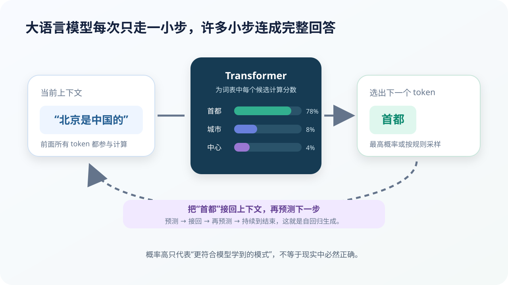

# 预测下一个 Token：回答怎样一小步一小步生成

## 本课目标

- 解释因果语言建模与自回归生成；
- 理解概率、采样、温度和上下文窗口；
- 说明“预测下一步”为什么能形成复杂能力，也为什么会产生错误。

## 核心任务听起来像文字接龙

给定前文，模型学习：

$$
P(t_i\mid t_1,t_2,\ldots,t_{i-1})
$$

意思是：知道前面所有 Token 时，第 (i) 个 Token 出现的概率。

例如输入“北京是中国的”，模型会为整个词表计算候选概率。“首都”可能最高，“城市”“中心”等也可能有较低概率。

## 自回归生成的循环

1. 读取当前上下文；
2. 计算下一个 Token 概率；
3. 按生成规则选择一个 Token；
4. 把它接到上下文末尾；
5. 再次运行模型；
6. 遇到结束标记、长度上限或系统停止条件后结束。

模型每一步只决定很小的单位，但几十、几百或几千步可以组成段落、代码和长文。

## 训练时为什么能并行

训练数据已有完整文字。通过因果遮罩，每个位置只能使用左侧 Token，却可以同时计算许多“前文 → 正确下一 Token”的任务：

| 模型可见的前文 | 目标 Token |
| --- | --- |
| 春 | 天 |
| 春天 | 来 |
| 春天来 | 了 |
| 春天来了 | ， |

生成时没有现成后文，因此必须把自己刚生成的结果接回去，逐步运行。

## 为什么相同问题可能得到不同答案

如果永远选概率最高的 Token，输出更稳定，却可能重复、僵硬或陷入局部模式。系统可以从一组高概率候选中采样。

### 温度

温度调整概率分布：

- 较低：更集中在高概率候选，输出更稳定；
- 较高：候选更分散，创造性增加，也更容易跑偏。

### Top-p

只在累计概率达到某个阈值的最小候选集合中采样，避免从极低概率的巨大词表尾部乱选。

### 随机种子

控制采样随机过程。在模型、提示和系统设置相同时，固定种子有助于复现，但不同平台未必保证完全一致。

## 只预测下一步，为什么能回答问题

要在海量文字中持续预测得好，模型必须压缩许多支撑文字的结构：

- 语法、指代、文体和篇章组织；
- 概念、人物、地点与事件的共现关系；
- 代码语法、函数调用和错误修复模式；
- 问题、步骤和答案之间的关系；
- 不同任务说明与输出格式。

规模扩大、数据多样和训练改进后，这些模式可以组合到新任务中，形成零样本、少样本和上下文学习能力。

但这不等于模型内置了“事实真伪检查器”。训练目标首先奖励合理后文，不保证每个事实都真实。

## 上下文窗口不是永久记忆

上下文窗口是一次计算能处理的 Token 范围。它可能包含：

- 系统指令；
- 当前对话；
- 上传文档的片段；
- 搜索或工具返回结果；
- 模型尚未输出的预留空间。

窗口很长也不保证模型同样准确地使用每一处细节。聊天产品的长期“记忆”通常是模型外的存储与检索，不是对话中自动重新训练参数。

## 一步错误为什么会扩散

自回归生成把自己的输出变成后续输入。如果早期生成了错误日期、错误变量名或错误前提，后面可能继续在这个错误世界里保持语言上的自洽。

降低风险的方法包括：

- 检索权威来源；
- 调用计算器或代码工具；
- 分步骤检查中间结果；
- 让不同方法交叉验证；
- 在关键结论处要求证据；
- 由人复核高风险输出。

## 小活动：你来预测下一个 Token

补全：“乌云越来越厚，没过多久，天空开始____。”

写出三个候选和概率。然后把前文改成“风把乌云吹散了”，重新分配概率。

思考：

- 概率最低的答案是否绝对不可能？
- 只改变一句前文，为什么概率会改变？
- 连续 100 次选择会不会在中途偏离原主题？

## 本课小结

- 因果语言模型预测给定前文时的下一 Token 概率；
- 自回归生成把每次输出接回上下文；
- 温度和采样规则影响稳定性与多样性；
- 预测任务迫使模型学习许多语言和知识结构；
- 生成的概率连贯性不等于事实正确，早期错误还会累积。

## 参考资料

- [Hugging Face：Causal Language Modeling](https://huggingface.co/docs/transformers/en/tasks/language_modeling)
- [Google：Introduction to Large Language Models](https://developers.google.com/machine-learning/crash-course/llm)
- [Language Models are Few-Shot Learners](https://arxiv.org/abs/2005.14165)

