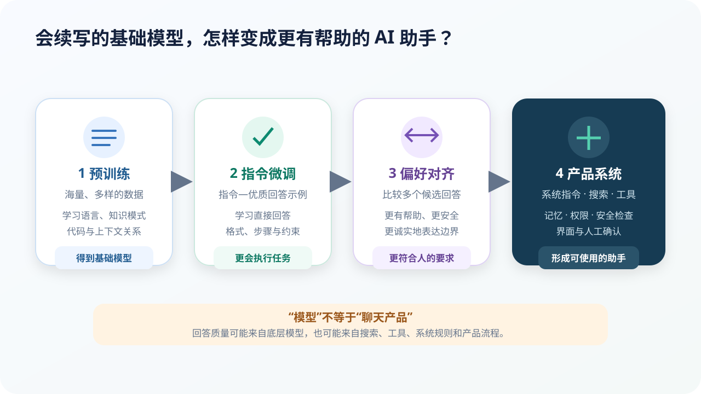

# 从基础模型到 AI 助手：会续写，不等于会帮助人

## 本课目标

- 区分预训练、指令微调和偏好对齐；
- 区分模型、搜索、RAG、微调和聊天产品；
- 解释工具与权限怎样改变模型的实际能力。

## 原始基础模型只关心“合理后文”

预训练语言模型在海量文字与代码上完成预测任务。它能学习语言、知识模式、文体、代码结构和一定的上下文学习能力，但并不天然知道用户希望它：

- 直接回答问题；
- 按指定格式输出；
- 承认不知道；
- 避免危险建议；
- 使用清晰、礼貌的表达。

如果用户输入“如何种一棵番茄”，原始模型可能继续写成论坛对话、广告、小说或问题本身，而不是一份可靠步骤。

## 从基础模型到助手的几个阶段

### 预训练：形成广泛基础能力

模型在大规模数据上学习 Token 预测，获得通用表示。这个阶段成本最高，得到的是基础模型。

训练数据通常还要经历过滤、去重、质量控制和混合比例设计。网页数量多不代表应该让低质量网页占据训练主体。

### 监督式指令微调（SFT）：学习怎样完成任务

训练者准备“指令—优质回答”示例，让模型学习：

- 怎样回答问答、摘要、翻译和写作任务；
- 怎样遵守长度、语气和格式要求；
- 怎样把复杂问题拆成清晰步骤；
- 怎样在信息不足时追问或说明假设。

### 偏好对齐：学习哪些回答更符合人的要求

同一问题可能有多个语法正确答案。人们可以比较候选回答，训练奖励模型或直接优化偏好，使输出更有帮助、更安全、更符合产品规则。

常见路线包括基于人类反馈的强化学习（RLHF）和直接偏好优化（DPO）。它们不是把“全人类价值观”一次性写进模型，而是在特定数据、标注指南和产品目标下进行调整。

### 安全训练与红队评估

开发者还会测试模型面对危险请求、隐私信息、欺骗、提示注入和越权操作时的行为。安全是持续过程：新工具、新语言和新使用场景都可能出现新问题。

## 模型、提示词、检索和微调有什么区别

| 方法 | 改变了什么 | 适合解决什么 | 不擅长解决什么 |
| --- | --- | --- | --- |
| 提示词 | 当前上下文 | 临时说明任务、格式和示例 | 不会永久修改模型参数 |
| RAG / 检索 | 给模型补充外部资料 | 更新知识、使用指定文档、提供来源 | 检索错了仍可能答错 |
| 微调 | 修改部分或全部参数 | 稳定风格、格式、领域行为或专门能力 | 不是实时更新事实的最佳方法 |
| 工具调用 | 允许执行外部函数 | 搜索、计算、代码、数据库和软件操作 | 权限、工具错误会带来新风险 |
| 更换模型 | 底层能力与成本 | 任务超出现有模型能力时 | 更大模型也不保证事实正确 |

### RAG 的简化流程

> 用户问题 → 在资料库中检索相关片段 → 把片段放进上下文 → 模型根据问题和片段回答

RAG 可以让答案基于指定资料，并提供可核验来源。但仍要检查：

- 检索是否漏掉关键资料；
- 片段是否过时或断章取义；
- 模型是否忠实使用片段；
- 引用是否真的支持结论。

## “聊天产品”由多个系统组成

日常使用的 AI 助手可能包括：

- 基础模型；
- 系统指令和对话模板；
- 输入与输出安全检查；
- 搜索和知识库；
- 计算器、代码执行器和其他工具；
- 用户授权的记忆与存储；
- 速率限制、日志和人工审核；
- 文字、语音、图片与文件界面。

因此两个使用同一底层模型的产品，也可能因为搜索、提示、工具和权限不同而表现不同。

## 对齐的难点

### 人的偏好并不完全一致

同一个回答，有人喜欢简洁，有人希望详细；不同文化、年龄和场景对合适表达也有差异。

### “看起来友好”不等于事实更可靠

偏好训练可能改善语气，却不能自动补齐精确事实。过度自信、讨好用户或迎合错误前提仍需要专门评估。

### 拒绝也可能出错

安全模型可能放过危险请求，也可能误拒绝正常的教育、新闻或健康信息。安全设计需要在风险与正当使用之间持续校准。

## 小练习：选择正确的改进方法

为下面问题选择“改提示、加 RAG、微调、加工具或换模型”，并说明理由：

1. 公司助手总是不知道昨天更新的内部制度；
2. 模型知道内容，却常把结果输出成错误 JSON 格式；
3. 模型需要计算 3791 × 8427；
4. 客服回答需要长期保持统一语气；
5. 系统要发送退款，但金额超过 100 元必须人工确认。

第 5 项不能只回答“加工具”，还必须设计权限和确认流程。

## 本课小结

- 预训练形成广泛模式，指令微调让模型更会做任务；
- 偏好对齐改善有用性与安全性，但不是永远正确的保证；
- 提示、RAG、微调和工具解决不同问题；
- 真实聊天助手是模型与多种产品系统的组合。

## 参考资料

- [OpenAI：Aligning language models to follow instructions](https://openai.com/index/instruction-following/)
- [InstructGPT 论文](https://arxiv.org/abs/2203.02155)
- [Direct Preference Optimization](https://arxiv.org/abs/2305.18290)
- [Retrieval-Augmented Generation](https://arxiv.org/abs/2005.11401)

