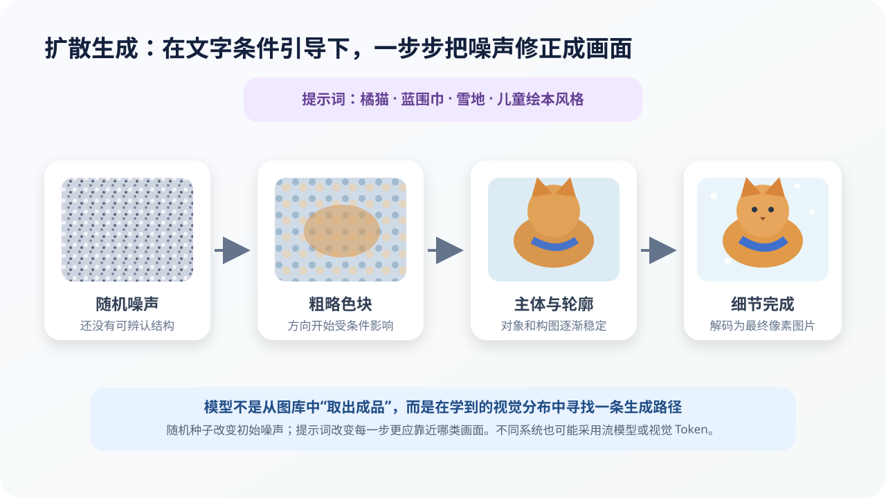

# 图片、视频与多模态生成：模型怎样从文字走向视觉和声音

## 本课目标

- 解释扩散生成与潜在空间；
- 说明视频生成为什么比单张图片更难；
- 理解多模态模型怎样对齐文字、图像和声音；
- 识别生成媒体的真实性、版权和隐私风险。

## 图片不能简单按像素逐个“续写”

高清图片包含数百万像素，而且远处像素共同决定物体、透视和光照。逐像素生成既慢，也难保持全局结构。

当前视觉生成存在多种路线，其中扩散模型及流模型是一条重要主线：从随机状态出发，在文字或图片条件引导下，逐步修正为合理画面。

## 扩散模型的直观过程

训练时，模型学习不同噪声程度下应该怎样修正。生成时则从随机噪声开始，多次调用网络：

> 随机噪声 → 粗略色块 → 主体轮廓 → 材质与细节 → 最终图片

训练不一定真的每次完整走完全部加噪步骤。常见做法是随机选择一个噪声等级，直接给训练样本加入相应噪声，再让网络预测噪声、速度或修正方向。

## 文字怎样控制画面

提示词先由文本编码器转换为向量。图像网络在每一步生成中通过交叉注意力等机制参考文字表示。

提示词“戴蓝色围巾的橘猫坐在雪地里，儿童绘本风格”同时提供：

- 主体：橘猫；
- 属性：蓝色围巾；
- 场景：雪地；
- 风格：儿童绘本。

它不是把这些词直接贴在像素上，而是改变生成过程中哪些方向更符合条件。

## 为什么在潜在空间工作

直接在高清像素空间反复计算代价很高。潜在扩散模型先用编码器把图片压缩到更小的潜在表示，在这个数学空间中生成，再由解码器还原为像素。

潜在表示不是普通缩略图。它由多个通道共同保存结构、纹理和语义信息。

现代系统也可能采用：

- Diffusion Transformer；
- 流匹配或整流流；
- 把图片表示为离散视觉 Token 并自回归生成；
- 在统一多模态网络中共同理解和生成文字与图片。

## 为什么相同提示会生成不同图片

随机种子改变初始噪声，因此主体位置、细节、构图可能变化。引导强度、采样步骤、模型版本、画幅与参考图也会影响结果。

高提示词遵循度不等于高真实性。模型可能在视觉上满足“像”，却违反文字、空间或物理细节。

## 视频为什么更难

一段 5 秒、每秒 24 帧的视频有 120 帧。模型不仅要让每帧合理，还要保持：

- 人物身份和衣着一致；
- 物体形状、位置和遮挡连续；
- 动作速度自然；
- 镜头运动一致；
- 事件因果顺序合理；
- 声音与画面对齐。

视频模型会处理时空小块或潜在视频表示，同时学习空间结构和时间变化。系统也可能先生成低分辨率短片，再提高帧率、分辨率并生成声音。

即使视频看起来有“物理感”，也不表示模型掌握了精确物理定律。物体仍可能凭空消失、穿透、恢复或改变身份。

## 多模态模型怎样连接不同信息

文字、图片、声音和视频原始形式不同：

- 文字是 Token 序列；
- 图片是像素网格或视觉小块；
- 声音是波形或频谱；
- 视频同时包含空间和时间。

模型会用相应编码器、分块或离散化方法转换为向量，再通过配对数据学习模态对齐：

- 图片与说明文字；
- 语音与转写；
- 视频与字幕；
- 图表与问答；
- 机器人画面、指令与动作。

多模态扩大了能力，也扩大了错误面：模型可能看错小字、读错坐标、混淆相似物体、误判声音来源或颠倒视频事件。

## 生成图片的四层核验

1. **提示符合：**是否满足主体、关系、数量和风格？
2. **内部一致：**手、文字、阴影、反射、遮挡和结构是否合理？
3. **来源与授权：**训练、参考图、人物肖像和品牌元素是否有合法依据？
4. **传播语境：**是否会让人误以为真实事件？是否清楚标注为生成内容？

> [!WARNING]
> 不要用真实同学、教师或公众人物的脸制作误导性内容；不要上传未经同意的私密照片；不要把生成图冒充新闻、证据或他人作品。

## 小活动：固定提示，只改变一个变量

选择合规图片生成工具，固定提示：

> 一座建在巨树枝干上的未来图书馆，傍晚，暖色灯光，儿童绘本风格。

依次只改变：

- 随机种子；
- “傍晚”为“清晨”；
- 横向画幅为纵向画幅；
- 加入“不要出现人物”。

记录哪些变化符合预期、哪些无关部分也被改变，以及画面中有哪些不合理结构。

## 本课小结

- 扩散与流模型从随机状态逐步形成图像；
- 潜在空间降低高清生成成本；
- 视频还要保持跨时间一致性与运动关系；
- 多模态模型把不同信息转换为可共同处理的表示；
- 视觉逼真不等于真实发生，必须检查来源、授权和传播语境。

## 参考资料

- [Denoising Diffusion Probabilistic Models](https://arxiv.org/abs/2006.11239)
- [High-Resolution Image Synthesis with Latent Diffusion Models](https://arxiv.org/abs/2112.10752)
- [Scalable Diffusion Models with Transformers](https://arxiv.org/abs/2212.09748)
- [Video Diffusion Models](https://arxiv.org/abs/2204.03458)
- [OpenAI：CLIP](https://openai.com/index/clip/)

