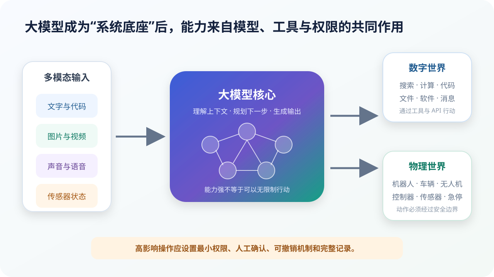

# Agent、世界模型与具身智能：从生成回答到执行任务

## 本课目标

- 区分聊天模型与 Agent；
- 理解工具、状态、任务循环和权限；
- 解释世界模型与视觉—语言—动作模型；
- 认识数字行动和物理行动的不同风险。

## 一次回答与一个任务不是同一件事

“解释水循环”可以由一次回答完成；“整理本周 AI 新闻、核对来源、做成表格并发给老师”却包含搜索、阅读、比较、写文件和发送等多个动作。

Agent 通常以大模型为决策核心，连接目标、工具、状态和控制循环：

> **观察状态 → 判断下一步 → 调用工具 → 查看结果 → 修正计划 → 继续或结束**

## Agent 的六个组成部分

| 组成 | 作用 |
| --- | --- |
| 目标与规则 | 说明任务、完成条件和禁止事项 |
| 大模型 | 理解上下文、选择步骤、生成工具参数 |
| 工具 | 搜索、计算、读写文件、运行代码、操作软件 |
| 状态 | 保存进度、中间结果、失败信息和预算 |
| 任务循环 | 执行后再观察，直到完成或停止 |
| 权限与护栏 | 限制数据、动作、花费和影响范围 |

Agent 不是“大模型突然获得超能力”。如果系统没有提供邮件工具，它就不能发送邮件；提供了工具但没有授权数据，它也不应访问数据。

## 工具结果也可能错

Agent 的错误来源比聊天模型更多：

- 模型选错工具；
- 参数填写错误；
- 搜索结果过时；
- 网页内容恶意诱导；
- 工具执行失败但模型误认为成功；
- 多步任务中的早期错误不断累积；
- 权限太大导致错误影响扩大。

因此，每个工具调用都应返回可检查的结构化结果；系统还要设置超时、重试上限、预算和停止条件。

## 权限设计：默认最小，关键步骤确认

可以把动作分为三级：

| 等级 | 示例 | 建议 |
| --- | --- | --- |
| 只读 | 阅读公开网页、查看用户指定文件 | 限定数据范围，记录来源 |
| 可逆写入 | 创建草稿、生成新文件 | 使用新文件或版本控制，允许撤销 |
| 高影响 | 发送消息、付款、删除、提交、控制设备 | 执行前人工确认，限制金额/对象/范围 |

确认不能只是笼统的“继续吗”。应让人看到：将执行什么动作、作用于哪个对象、发送哪些数据、是否可撤销。

## 世界模型：预测“行动以后会发生什么”

世界模型学习状态随动作和时间变化的规律。它可以：

- 预测未来画面或状态；
- 比较不同动作的可能结果；
- 在内部进行规划；
- 为机器人或游戏智能体提供训练环境。

世界模型仍是现实的近似。罕见事件、复杂接触、人的反应和真实物理细节可能预测错误。它适合辅助规划，不应被当成现实的完美替身。

## 具身智能不是“给聊天机器人装身体”

具身智能强调智能体拥有身体，通过传感器感知、通过动作与环境交互，并在反馈中完成任务。

视觉—语言—动作模型（VLA）的简化链条是：

> 摄像头图像 + 语言指令 + 机器人状态  
> → 模型生成动作表示  
> → 底层控制器执行  
> → 传感器反馈  
> → 再次调整

“把红色积木放进左边盒子”需要识别对象、理解空间关系、规划抓取、执行运动并持续校正。

## 为什么物理世界需要更硬的边界

文字回答可以重新修改，机械臂碰撞却可能立即造成损坏。Physical AI 除了模型，还需要：

- 速度、力量和活动范围限制；
- 碰撞检测和安全距离；
- 独立的底层实时控制器；
- 急停装置；
- 仿真、台架和真实环境逐级测试；
- 人工监督与责任记录；
- 不可被上层模型绕过的硬规则。

大模型可以提供语言理解和高层规划，但不能取代控制、机械与安全工程。

## 学生怎样负责任地使用 Agent

Agent 可以帮助拆解任务、检索资料、整理笔记、生成练习和测试代码。学习者仍应保留：

- 任务目标的决定；
- 来源与数字的核验；
- 对中间步骤的理解；
- 自己的表达和反思；
- 提交前的最终责任。

把作业整个交给 Agent 再复制结果，得到的是更快完成，不是更强能力。

## 设计练习：校园节水 Agent

任务：“制作一份关于校园节水的两页资料。”

请列出：

1. 哪些信息必须从权威来源搜索？
2. 哪些步骤可以让模型自动完成？
3. 哪些数字必须由人复算？
4. 是否允许 Agent 直接发送给全校？
5. 如何标注 AI 参与和引用来源？
6. 如果搜索结果互相矛盾，停止条件是什么？

## 本课小结

- Agent 是模型、工具、状态和循环组成的系统；
- 工具扩大能力，也引入权限和错误传播风险；
- 世界模型预测行动后的可能状态；
- VLA 把视觉、语言和动作连接起来；
- 物理行动必须由独立安全工程约束。

## 参考资料

- [ReAct：Synergizing Reasoning and Acting](https://arxiv.org/abs/2210.03629)
- [Toolformer](https://arxiv.org/abs/2302.04761)
- [Google DeepMind：RT-2](https://deepmind.google/blog/rt-2-new-model-translates-vision-and-language-into-action/)
- [OpenVLA](https://arxiv.org/abs/2406.09246)
- [NVIDIA：What Is Physical AI?](https://www.nvidia.com/en-us/glossary/generative-physical-ai/)

