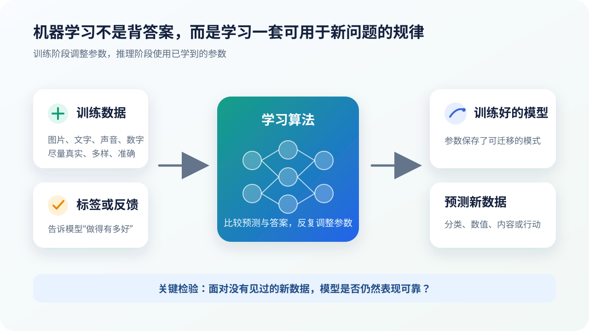

# 从规则到机器学习：什么时候应该让计算机“从例子中学”

## 本课目标

完成本课后，你将能够：

- 比较普通程序与机器学习程序的工作方式；
- 解释人工智能、机器学习和深度学习的包含关系；
- 判断一个问题是否真的适合使用机器学习。

## 普通程序从明确规则出发

计算总分、设置闹钟、判断一个数是不是偶数，都有清楚而稳定的步骤。程序员可以直接把这些步骤写成代码：

> **输入数据 + 人写的规则 → 结果**

例如，计算三门课总分只需读取三个数字并相加。只要输入有效，规则不会因为换了学生、教室或天气而改变。对于这种问题，传统程序通常更直接、更便宜，也更容易检查。

## 有些规则很难写完

现在试着为“照片里有没有猫”写一套规则：尖耳朵、胡须、四条腿、尾巴……很快就会遇到例外：

- 猫可能趴着，只露出头；
- 夜晚照片里看不清颜色；
- 玩偶和狐狸也可能有尖耳朵；
- 相机角度、背景和遮挡不断变化。

这不是程序员不够努力，而是现实世界包含太多连续变化和例外。语音识别、手写文字识别、垃圾邮件过滤、医学影像分析也有类似困难。

机器学习把问题改写为：

> 能不能准备足够多的例子和反馈，让一个数学模型自己调整参数，找到对新例子也有用的模式？

## 机器学习不是“把答案存进去”

在监督学习的例子中，我们可能给模型看许多已经标注的图片：

- 这张是猫；
- 这张不是猫；
- 这张虽然只露出半张脸，仍然是猫；
- 这张是毛绒玩具，不是猫。

训练算法会比较模型预测与正确标签，再调整内部参数。训练完成后，模型面对一张未见过的图片，会根据参数中形成的模式给出预测。

因此：

- 模型不是逐张搜索训练图片；
- 参数也不是“一条参数对应一条知识”；
- 学到的是一种统计关系，而不是永远正确的自然法则；
- 预测结果必须在新数据上检验。

## AI、机器学习和深度学习的关系

| 概念 | 关注点 | 例子 |
| --- | --- | --- |
| 人工智能（AI） | 让机器完成通常需要感知、推理、规划或语言能力的任务 | 搜索、规则系统、机器学习、机器人规划 |
| 机器学习（ML） | 让模型从数据或经验中改善表现 | 线性回归、决策树、神经网络 |
| 深度学习（DL） | 使用多层神经网络学习复杂表示 | 图像识别、语音识别、大语言模型 |

它们通常可以写成：

> **人工智能 ⊃ 机器学习 ⊃ 深度学习**

这只是范围关系，不是能力排行榜。传统机器学习并没有因为深度学习出现就失去价值，规则系统也不会因为机器学习流行就应该全部替换。

## 什么问题适合机器学习

一个任务更可能适合机器学习，通常是因为：

1. 很难写出完整规则；
2. 有足够多、具有代表性的历史数据；
3. “做得好不好”能够被定义和测量；
4. 允许一定错误率，并有处理错误的机制；
5. 数据中的规律在未来不会立刻完全失效。

一个任务不一定需要机器学习，如果：

- 规则简单明确；
- 必须给出可证明的精确结果；
- 数据极少或质量无法保证；
- 错误可能直接造成严重伤害，却没有人工复核；
- 目标本身含糊，连人类也无法一致判断正确答案。

### 场景判断

| 场景 | 更合适的起点 | 理由 |
| --- | --- | --- |
| 计算长方形面积 | 普通程序 | 公式明确且结果必须精确 |
| 判断照片中是否有交通标志 | 机器学习 | 外观、光线和角度变化多 |
| 满足温度阈值就打开风扇 | 规则与自动化 | 条件清楚，不必训练模型 |
| 根据历史销量估计下周需求 | 机器学习 + 人工判断 | 存在统计规律，也会受突发事件影响 |
| 决定学生是否值得被录取 | 不能只交给模型 | 涉及价值判断、公平、解释和申诉权 |

## 常见误区

> [!NOTE]
> **“使用了数据”不等于机器学习。** 电子表格读取数据后按固定公式计算，仍然是普通程序。关键在于模型的参数是否通过数据与反馈发生了改变。

> [!WARNING]
> **“准确率高”不自动等于“适合上线”。** 还要看测试数据是否真实、错误发生在哪些人群、错误后果是什么，以及是否有人工复核。

## 检查理解

### 第 1 题

**题目：** 下面哪一项最符合机器学习的特点？

- A. 程序员写出所有判断规则
- B. 模型利用样本和反馈调整参数
- C. 计算机随机尝试并永远不检查结果

**正确答案：** B。

**解析：** 机器学习的核心不是“随机”或“自动”，而是根据数据和目标调整模型，使它在任务上的表现改善。

### 思考题

找出生活中的一个智能功能，分别写出它的输入、输出、可能使用的数据，以及一次错误会带来什么后果。不要只写产品名称。

## 本课小结

- 规则明确的问题，普通程序通常更合适；
- 规则难以写全但有代表性数据的问题，可以考虑机器学习；
- 机器学习学习的是可调参数中的统计模式；
- 深度学习是机器学习的一个分支，不是人工智能的全部。

## 参考资料

- [Google：Introduction to Machine Learning](https://developers.google.com/machine-learning/intro-to-ml)——机器学习问题、监督学习与常见模型的入门说明。
- [Google Machine Learning Crash Course](https://developers.google.com/machine-learning/crash-course)——从回归、分类到神经网络和真实系统的完整课程。
- [《动手学深度学习》](https://zh.d2l.ai/)——可继续学习模型与代码实践。

