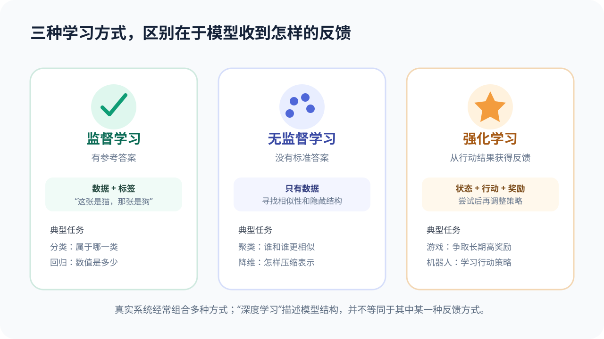

# 数据、特征、标签与学习方式：模型到底“吃”什么

## 本课目标

- 解释数据、样本、特征、标签、模型和参数；
- 区分分类、回归、聚类与强化学习；
- 发现数据不完整、标签错误、类别失衡和数据泄漏等问题。

## 六个必须先分清的词

以垃圾邮件识别为例：

| 关键词 | 通俗解释 | 例子 |
| --- | --- | --- |
| 样本 | 一次可以被模型处理的记录 | 一封历史邮件 |
| 数据集 | 许多样本组成的集合 | 十万封历史邮件 |
| 特征 | 模型用于判断的信息 | 词语、链接数量、发件域名 |
| 标签 | 已知答案或目标 | 垃圾邮件 / 正常邮件 |
| 模型 | 从输入映射到输出的数学关系 | 邮件分类函数 |
| 参数 | 训练中被调整的内部数字 | 某些模式对预测的影响权重 |

**训练**是利用数据和反馈调整参数；**推理**则是在参数基本固定后，用模型处理新输入。

## 一条可靠的数据链

数据在进入模型以前，通常要经历：

1. **定义任务：**到底预测什么，错误如何衡量？
2. **收集样本：**来源是否真实、合法、有代表性？
3. **清洗数据：**处理重复、缺失、格式错误和明显异常；
4. **建立标签：**谁来标注？不同标注者意见不一致怎么办？
5. **划分数据：**训练集、验证集、测试集严格分开；
6. **记录版本：**数据什么时候收集、做过哪些处理？
7. **持续监测：**上线后的真实输入是否已经改变？

> [!NOTE]
> 数据清洗不是把所有“不同寻常”的样本都删掉。少见情况可能正是模型上线后最需要正确处理的情况。

## 三种常见学习方式

### 监督学习：带着参考答案学习

监督学习使用带标签的样本。常见任务包括：

- **分类：**输出类别或类别概率，例如猫 / 狗 / 兔子；
- **回归：**输出连续数值，例如气温、用电量或价格估计。

分类模型输出“猫 80%”时，80%是模型内部对候选类别的相对信心。它不是“现实世界有 80% 是猫”的哲学保证，也需要经过校准和测试。

### 无监督学习：没有标准答案，寻找结构

没有标签时，可以寻找相似性或压缩表示：

- **聚类：**把相似用户、文章或商品放在一起；
- **降维：**用较少维度保留主要结构，便于可视化或后续建模；
- **异常检测：**寻找与多数样本明显不同的记录。

聚类结果不是世界上唯一正确的分组。换一种特征、距离或算法，结果可能改变。

### 强化学习：从行动结果获得奖励

强化学习中的智能体在环境中行动，并根据长期奖励调整策略。它关注的不只是“当前一步对不对”，还要考虑一连串行动的后果。

例如，机器人学走路时，如果奖励只写成“速度越快越好”，它可能找到危险或奇怪的动作。这提醒我们：**模型会努力优化你写下的目标，而不一定自动理解你真正想要什么。**

### 扩展：自监督学习

大规模文字、图片和语音经常没有人工标签。自监督学习会从数据自身构造学习任务，例如：

- 遮住句子中的一部分，让模型恢复；
- 根据前文预测下一个 Token；
- 判断两种图像变换是否来自同一张图片；
- 从有噪声音中恢复更干净的表示。

它减少了人工标注需求，但并不意味着数据来源、质量和版权问题消失。

## 数据最容易在哪些地方“骗过”我们

### 标签错误

如果训练图片中狐狸被误标成猫，模型会收到矛盾反馈。对于带有主观性的任务，应记录标注规则，并检查标注者之间的一致程度。

### 类别失衡

假设 1000 封邮件中只有 10 封垃圾邮件。一个模型把所有邮件都判断为正常，也能达到 99% 准确率，却完全没有完成任务。

此时还要检查召回率、精确率、混淆矩阵，以及不同错误的代价。

### 代理标签

真实目标可能难以直接测量，于是使用替代指标。例如用“观看时长”代表“内容有价值”。但长时间观看也可能来自争议、焦虑或自动播放。代理标签会把人的复杂需求压缩成一个数字，需要不断审视。

### 数据泄漏

模型无意中看到了预测时不可能获得的信息，叫作数据泄漏。例如用“病人最终使用了哪种治疗”预测病人最初是否患病。离线成绩会异常优秀，上线后却失效。

### 数据没有代表真实世界

只在晴天采集的道路图片，无法代表雨雪、夜晚和逆光；只采集一种口音的语音，也不能说明模型能服务所有人。

## 小练习：设计一个校园垃圾分类模型

假设你想识别“可回收物、厨余垃圾、有害垃圾、其他垃圾”。请填写：

- 输入：拍照、重量、材质信息，还是多种信息？
- 标签：谁负责标注？遇到有争议的物品怎么办？
- 数据多样性：不同光线、角度、破损程度是否覆盖？
- 类别失衡：有害垃圾样本少，怎样避免被忽略？
- 隐私：图片里是否会出现人脸、姓名或教室信息？
- 评估：把有害垃圾误判为普通垃圾，与反过来的错误是否同样严重？

## 检查理解

**题目：** 某模型在 1000 个样本上达到 99% 准确率，能否直接判断它很好？

**参考答案：** 不能。还需要知道类别比例、数据来源、划分方式、是否泄漏、每类错误数量，以及测试集是否代表真实使用环境。

## 本课小结

- 数据质量和任务定义共同决定模型能学到什么；
- 不同学习方式的关键差异，是模型收到怎样的反馈；
- 高准确率可能被类别失衡或数据泄漏伪装；
- 数据集不是现实世界本身，只是现实的一次有限采样。

## 参考资料

- [Google：Datasets, generalization, and overfitting](https://developers.google.com/machine-learning/crash-course/overfitting)——数据集划分、泛化和过拟合。
- [Google Machine Learning Glossary](https://developers.google.com/machine-learning/glossary)——机器学习术语定义。
- [PyTorch：Learn the Basics](https://docs.pytorch.org/tutorials/beginner/basics/intro.html)——从数据加载到训练循环的实践入口。

