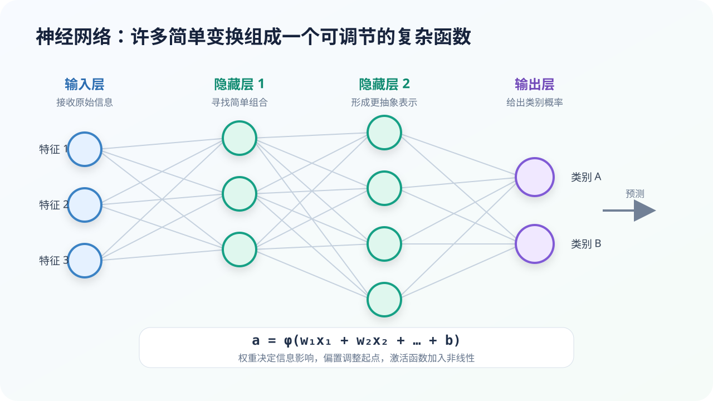

# 神经网络如何计算：从一个神经元到多层表示

## 本课目标

- 把神经网络理解为带参数的数学函数；
- 解释权重、偏置和激活函数；
- 描述多层网络怎样逐步改变信息表示。

## 先从函数开始

函数描述输入与输出的关系。例如：

$$
y=2x+1
$$

神经网络也可以写成：

$$
\hat{y}=f(x;\theta)
$$

其中，(x) 是输入，(\hat{y}) 是模型预测，(f) 是网络执行的计算，(\theta) 代表所有可训练参数。

一张图片的输入可能是数百万个像素值，一句话的输入可能是一串 Token 向量。网络的任务是把这些高维输入一步步转换成适合当前任务的输出。

## 一个神经元做了两件事

最基本的人工神经元可以表示为：

$$
z=w_1x_1+w_2x_2+\cdots+w_nx_n+b
$$

$$
a=\phi(z)
$$

它先对输入做**加权汇总**，再经过一个**非线性激活函数**。

- (x_i)：输入信息；
- (w_i)：权重，控制某项输入影响有多大；
- (b)：偏置，调整整体起点；
- (\phi)：激活函数；
- (a)：神经元输出。

可以把权重想成调音台上的推子：某些信号被放大，某些被减弱。训练不是手工推每一个推子，而是用误差计算出更合适的调整方向。

## 为什么必须有非线性

如果每一层只进行线性运算，多层线性函数合在一起仍然只是一个线性函数。它无法表示很多弯曲、分段和相互影响的关系。

激活函数让网络获得非线性能力。常见的 ReLU 可以简单写成：

$$
\operatorname{ReLU}(z)=\max(0,z)
$$

当输入为负时输出 0，为正时保留原值。虽然规则简单，但大量神经元组合以后可以形成复杂的决策边界。

## 从一个神经元到一张网络

- **输入层：**接收数值化的原始信息；
- **隐藏层：**对信息反复变换与组合；
- **输出层：**形成分类概率、数值或其他目标表示。

“隐藏”不是说模型故意保守秘密，而是这些中间层没有人工提供的逐层正确答案。训练数据通常只告诉模型最终目标，中间表示由模型在优化过程中形成。

## 一个小例子：判断是否适合户外运动

输入可以包括温度、降雨概率、空气质量和风速。第一层神经元可能组合出“天气舒适度”“降水风险”等中间表示；更深层再结合这些表示，输出“适合 / 不适合”的概率。

真实网络不会保证某个神经元恰好对应一个人类可命名概念。表示往往分散在许多神经元和参数之间。因此，解释神经网络通常需要专门方法，而不能只寻找一个“猫神经元”或“知识参数”。

## 参数多意味着什么

更多参数通常让模型能够表达更复杂的函数，但也意味着：

- 需要更多数据或更强的约束；
- 训练和推理成本可能增加；
- 更容易记住训练数据中的偶然细节；
- 内部机制更难完整解释。

所以“参数更多”不是质量保证。模型大小必须与数据、任务、算力和风险相匹配。

## 纸上实验：自己当一个神经元

假设用下面的简单式子判断是否带伞：

$$
z=0.7\times\text{降雨概率}+0.2\times\text{乌云程度}-0.1\times\text{室内活动比例}-0.4
$$

把每项输入都设为 0 到 1 的数。当 (z>0) 时建议带伞，否则不建议。

尝试两组输入，然后思考：

1. 为什么“降雨概率”的权重最大？
2. 偏置 (-0.4) 改成 (-0.1) 后，模型会更容易建议带伞还是更难？
3. 固定权重是否能够应对所有城市和季节？

这个例子由人手工设置权重；神经网络训练的核心，就是让数据帮助我们调整大量权重。

## 常见误区

> [!NOTE]
> 人工神经网络的名称受生物神经系统启发，但现代网络不是人脑的真实复制。它首先是一套可微分的数学计算结构。

> [!NOTE]
> 神经网络输出概率，不代表它理解了概率背后的现实意义。概率还需要用独立数据检查是否校准。

## 本课小结

- 神经网络是一个带大量可调参数的函数；
- 神经元完成加权汇总和非线性变换；
- 多层网络把简单变换组合成复杂映射；
- 参数越多不自动越聪明，仍需数据、训练和评估支持。

## 参考资料

- [Google：Neural Networks](https://developers.google.com/machine-learning/crash-course/neural-networks)——感知机、隐藏层与激活函数。
- [Deep Learning](https://www.deeplearningbook.org/)——Goodfellow、Bengio 与 Courville 编写的经典教材。
- [Stanford CS231n：Neural Networks Part 1](https://cs231n.github.io/neural-networks-1/)——神经网络结构与计算的进一步说明。

