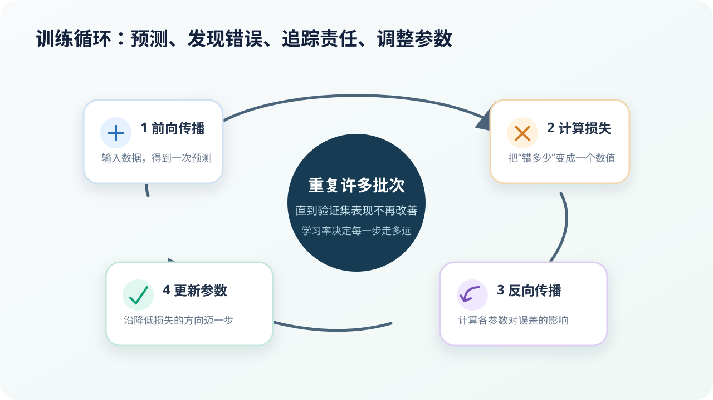

# 模型如何从错误中学习：损失、反向传播与梯度下降

## 本课目标

- 描述一次完整训练循环；
- 区分损失函数、反向传播和优化器的作用；
- 解释学习率、批次与训练轮次为什么会影响结果。

## 训练不是“多看几遍数据”这么简单

神经网络训练是一套重复计算：

> **前向传播 → 计算损失 → 反向传播 → 更新参数**

## 第一步：前向传播

输入从第一层流向最后一层，模型得到预测。假设手写数字图片的正确答案是“3”，模型却给出：

| 候选数字 | 预测概率 |
| --- | ---: |
| 3 | 15% |
| 5 | 70% |
| 其他 | 15% |

这次预测明显偏向“5”。前向传播只负责算出结果，还没有修改参数。

## 第二步：损失函数把错误变成数值

为了让计算机知道应该怎样调整，必须定义“错得多严重”。损失函数会把预测和目标之间的差异压缩成一个数值。

- 损失小：预测通常更接近目标；
- 损失大：预测与目标差距更明显；
- 训练目标：降低许多样本上的平均损失。

不同任务使用不同损失。回归可以关心数值距离，分类常使用交叉熵。损失函数是训练的“评分规则”，写错评分规则，模型就可能认真地学错方向。

## 第三步：反向传播追踪每个参数的影响

网络可能有数百万甚至更多参数。反向传播利用微积分中的链式法则，从输出误差向前计算每个参数对损失的影响，也就是梯度。

它回答的不是“谁应该被责怪”，而是一个精确的数值问题：

> 如果把这个参数稍微增大，损失会增加还是减少？变化有多快？

反向传播不会直接更新参数，它负责高效计算梯度。

## 第四步：优化器更新参数

梯度下降及其改进算法根据梯度移动参数。最简单的更新可写成：

$$
\theta_{new}=\theta_{old}-\eta\nabla_\theta L
$$

- (L)：损失；
- (\nabla_\theta L)：损失对参数的梯度；
- (\eta)：学习率；
- 减号：沿着使损失降低的方向移动。

### 学习率为什么重要

- 太大：可能跨过低点，损失来回震荡甚至发散；
- 太小：学习稳定但非常慢，也可能困在不理想区域；
- 合适：在速度与稳定之间取得平衡。

现代训练还会使用学习率预热、衰减、Adam 等方法，但核心仍是根据梯度更新参数。

## 批次、轮次与随机性

### 小批次（mini-batch）

一次把全部数据放进模型可能超出内存，也会让每次更新很慢。训练常把数据分成小批次，每处理一批就更新一次参数。

### 训练轮次（epoch）

模型完整看过一遍训练集，称为一个 epoch。训练 20 个 epoch 意味着每个样本通常被使用了约 20 次，但每次模型参数都不同。

### 随机打乱

每轮重新打乱样本，能减少模型被固定顺序误导。随机初始化、数据采样和硬件计算差异，也会让两次训练结果不完全相同。

## 训练集损失下降，为什么还不能庆祝

模型可以通过记住训练样本继续降低训练损失，却在验证集上变差。训练过程中应同时观察：

- 训练损失；
- 验证损失；
- 任务真正关心的指标；
- 不同类别和人群上的表现；
- 预测置信度是否合理。

验证损失开始持续上升时，继续训练可能正在过拟合。可以考虑提前停止、增加有效数据、正则化或调整模型复杂度。

## 动手推演：一步更新发生了什么

假设一个极简模型是 (\hat{y}=wx)。输入 (x=2)，目标 (y=6)，当前权重 (w=2)：

1. 预测：(\hat{y}=2\times2=4)；
2. 模型预测偏小；
3. 梯度会指示“适当增大 (w)”有助于降低损失；
4. 更新以后，例如 (w=2.2)，新预测变为 4.4，更接近 6；
5. 重复许多样本与许多轮以后，权重可能逐渐靠近 3。

真实网络的参数和路径要复杂得多，但基本逻辑没有改变。

## 常见误区

> [!NOTE]
> **反向传播不是模型“反着思考”。** 它是一种计算梯度的方法。

> [!NOTE]
> **损失为零也不等于现实表现完美。** 数据可能有泄漏，指标可能没有覆盖真实风险，或者模型只记住了训练样本。

## 检查理解

**题目：** 学习率太大最可能造成什么现象？

- A. 参数完全不更新
- B. 每一步跨得太远，损失震荡或发散
- C. 自动防止所有过拟合

**正确答案：** B。

## 本课小结

- 前向传播产生预测，损失函数度量错误；
- 反向传播计算各参数对损失的影响；
- 优化器根据梯度更新参数；
- 训练过程必须同时观察验证表现，而不是只追求训练损失更低。

## 参考资料

- [Learning representations by back-propagating errors](https://www.nature.com/articles/323533a0)——反向传播的重要历史论文。
- [Google：Gradient Descent](https://developers.google.com/machine-learning/crash-course/linear-regression/gradient-descent)——梯度下降的直观解释。
- [PyTorch：The Full Model Building Process](https://docs.pytorch.org/tutorials/beginner/introyt/trainingyt.html)——训练循环的代码实践。

