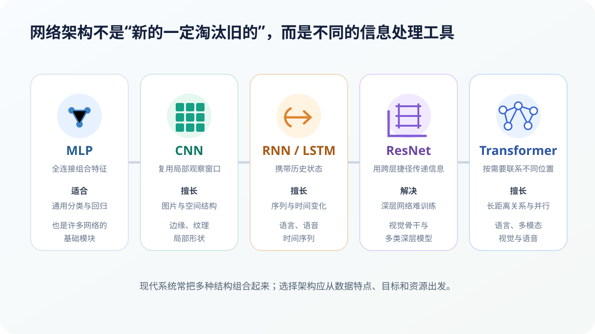

# 从 MLP 到 Transformer：网络架构为什么不断演变

## 本课目标

- 识别 MLP、CNN、RNN/LSTM、ResNet 与 Transformer 的核心设计；
- 把架构选择与数据结构联系起来；
- 避免“新架构完全淘汰旧架构”的误解。

## 架构是在回答“信息应该怎样连接”

神经元本身只做简单运算。网络架构决定：

- 哪些位置可以直接交换信息；
- 参数能否在不同位置复用；
- 历史状态怎样保存；
- 信息和梯度怎样穿过很多层；
- 计算能否并行。

## MLP：通用的全连接组合器

多层感知机（MLP）让一层中的神经元与下一层广泛连接。它可以学习非线性关系，也是现代网络中前馈模块的基础。

但如果直接处理高清图片，完全连接会产生大量参数，而且没有利用“相邻像素关系更紧密”的空间结构。

**适合：**表格特征、分类回归、小型网络模块，以及其他架构中的前馈层。

## CNN：在图片上复用局部观察窗口

卷积神经网络（CNN）使用小型卷积核在图片不同位置寻找相同局部模式。它利用两点：

1. 相邻像素通常关系更密切；
2. 同一种边缘或纹理可能出现在任何位置。

参数共享减少了计算，也带来一定位置适应能力。CNN 不只用于分类，还广泛用于目标检测、分割、医学影像和工业质检。

**重要节点：**LeNet 展示了卷积网络在手写字符识别中的作用；AlexNet 在 2012 年结合大规模数据、GPU 和深层 CNN 推动计算机视觉突破。

## RNN 与 LSTM：让历史状态随序列传递

文字、声音和传感器数据有明确顺序。循环神经网络（RNN）会把前一步的状态传给下一步，从而使用历史信息。

普通 RNN 在长序列中可能出现梯度消失或爆炸。LSTM 使用门控结构决定哪些信息保留、写入或遗忘，改善长期依赖问题。

RNN 需要按顺序计算，难以充分并行。Transformer 后来成为大规模语言模型的主流，但 RNN 在流式、低延迟和部分时序任务中仍然有用。

## ResNet：给深层网络增加“捷径”

网络加深后，理论表达能力增强，实际优化却可能变难。ResNet 的残差连接让输入可以绕过若干层直接传到更后面：

$$
y=F(x)+x
$$

网络不必每次从零学习完整映射，而可以学习“在原输入上应该修改多少”。这让非常深的网络更容易训练，也启发了后来许多架构。

## Transformer：让不同位置按需要相互参考

Transformer 把注意力机制放在核心位置。每个 Token 可以根据当前任务，从其他位置汇总信息。

它的重要优势包括：

- 更容易建立长距离联系；
- 训练时可以并行处理多个位置；
- 架构容易扩展到大量数据和参数；
- 可以迁移到视觉、语音、视频与多模态。

代价也很明确：标准自注意力对序列长度的计算和内存开销增长很快，因此长上下文需要高效注意力、稀疏化、缓存等工程优化。

## 不是直线淘汰，而是组合工具箱

现代系统经常组合结构：

- 视觉模型可以用卷积提取局部特征，再用 Transformer 建立全局关系；
- 语音系统可以使用卷积降低时间分辨率，再用注意力处理上下文；
- Transformer 内部仍包含 MLP；
- 残差连接几乎遍布深层网络；
- 机器人系统还会组合感知网络、规划器和传统控制器。

因此，不应只问“哪个架构最新”，而应问：

1. 数据的空间、时间或关系结构是什么？
2. 需要多长上下文？
3. 训练与部署资源有多少？
4. 是否要求实时、端侧或可解释？
5. 错误代价与评估标准是什么？

## 架构侦探练习

为下面任务选择一个合理起点，并说明理由。答案不唯一：

- 判断表格中的贷款违约风险；
- 从胸部影像中分割异常区域；
- 按时间预测传感器故障；
- 翻译长文档；
- 在手机上实时识别一个唤醒词。

优秀答案不只写模型名字，还要写数据结构、资源限制和错误代价。

## 本课小结

- MLP 组合通用特征；CNN 利用局部空间结构；
- RNN/LSTM 携带序列历史；ResNet 改善深层训练；
- Transformer 用注意力建立位置间联系并支持并行；
- 现代系统往往组合多种结构，没有万能架构。

## 参考资料

- [LeNet：Gradient-Based Learning Applied to Document Recognition](https://yann.lecun.com/exdb/publis/pdf/lecun-98.pdf)
- [AlexNet：ImageNet Classification with Deep Convolutional Neural Networks](https://papers.nips.cc/paper/4824-imagenet-classification-with-deep-convolutional-neural-networks.pdf)
- [ResNet：Deep Residual Learning for Image Recognition](https://www.cv-foundation.org/openaccess/content_cvpr_2016/papers/He_Deep_Residual_Learning_CVPR_2016_paper.pdf)
- [Attention Is All You Need](https://arxiv.org/abs/1706.03762)

