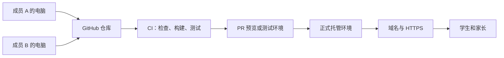
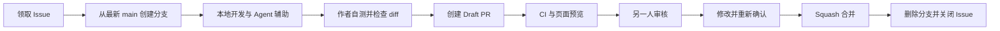
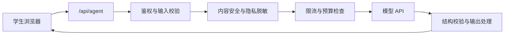
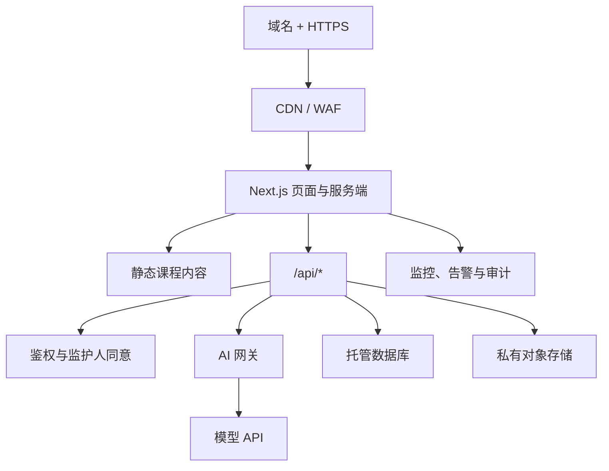

# AI 基础教育网站：两人协作与分阶段部署方案 V0.2

> 适用项目：面向中小学生的 AI 科普课程、AI 创作实验室与 AI 学习实验室  
> 团队规模：2 人，使用 Vibe Coding 辅助开发  
> 更新日期：2026-07-26

## 0. 结论先行

| 问题 | 建议 |
| --- | --- |
| 两个人是否共用一个项目？ | 是。使用一个 GitHub 仓库和一个始终可运行的 `main` 分支。 |
| 是否通过不同分支开发后合并？ | 是，但分支应按 Issue/任务创建，而不是一人一个长期分支。 |
| 是否需要 `develop` 分支？ | 暂时不需要。两人团队维护 `main + 短期任务分支` 更简单。 |
| 是否要先统一审美？ | 要先统一“最低设计基线”，但不需要先精修全部页面。 |
| 能否先填满内容，最后再统一 UI？ | 不建议。先完成设计系统 V0.1 和一篇真实样板课，再让内容与 UI 并行。 |
| 现在是否要买服务器？ | 不需要。本地开发和 GitHub 协作不需要购买云服务器。 |
| 真实 Agent 是否必须买传统服务器？ | 不一定，但必须有可信的服务端执行环境，例如 Serverless、托管后端或云主机。 |
| GitHub 是否等于网站服务器？ | 不等于。GitHub 主要负责代码、Issue、PR、版本和自动化流程。 |

最适合本项目的总体策略是：

> 先共同确定结构、样板页和设计系统，再把课程内容与公共组件分离开发；先完成零 API 的静态体验，出现真实 Agent、账号和作品保存需求后，再逐步增加服务端、数据库与对象存储。

## 1. 正确认识“项目、GitHub、托管与服务器”

“创建网站项目”是编写和管理代码；“部署”是让其他人可以通过网络访问网站。

只要网站可以被公网访问，背后就一定存在某种托管资源，但这不代表团队必须购买并维护一台传统云主机。托管资源可以是：

- 静态网站托管；
- CDN 和对象存储；
- Serverless 函数；
- 托管 Next.js 平台；
- 容器服务；
- 自己管理的云服务器。

Next.js 官方支持 Node.js Server、Docker、静态导出和平台适配等多种部署方式。静态导出功能较少，但足以承载课程、目录和预置 Demo；需要服务端功能时再升级即可。[Next.js 部署方式](https://nextjs.org/docs/app/getting-started/deploying)



各部分职责如下：

| 组成 | 作用 | 是否第一天就需要 |
| --- | --- | --- |
| 本地 Next.js 项目 | 编写课程、页面和两个实验室 | 是 |
| GitHub | 代码备份、Issue、分支、PR、版本管理 | 是 |
| 设计系统 | 保证两个人和 Agent 生成的页面风格一致 | 是，先做最小版本 |
| PR 预览/测试托管 | 让另一人或小范围用户远程体验 | 可稍后 |
| 服务端执行环境 | 保护密钥、调用模型、鉴权和限流 | 接入真实 Agent 时 |
| 数据库 | 保存账号、同意记录、学习进度和作品元数据 | 出现对应需求时 |
| 对象存储 | 保存图片、导出文件和作品附件 | 出现上传/导出需求时 |
| 域名与备案 | 面向公众正式访问 | 正式公测前 |

## 2. 两个人如何分工

推荐采用“主责明确、互相审核”，而不是两个人同时修改所有模块。

| 工作领域 | 成员 A：技术与 UI 主责 | 成员 B：产品与内容主责 |
| --- | --- | --- |
| 产品范围 | 参与评估技术成本 | 负责学习目标、用户路径和优先级 |
| 设计系统 | 负责 token、公共组件、响应式布局 | 负责适龄性、可读性和内容呈现验收 |
| 课程系统 | 负责阅读器、目录、进度组件 | 负责大纲、正文、互动题和资料核对 |
| AI 创作实验室 | 主开发与安全边界 | 负责学生流程、示例和验收 |
| AI 学习实验室 | 负责数据结构、服务端和导出 | 主导教学流程、提示策略和结果质量 |
| 部署与运维 | 主责 | 必须能按文档完成基本发布和回滚 |
| PR 审核 | 审核技术、安全和可维护性 | 审核内容、适龄性和学习体验 |

这只是主责，不是知识隔离。每个模块都必须由另一人实际运行和审核。

### 2.1 决策权提前约定

两人最容易卡在“谁说了算”。建议在开工前约定：

- UI 细节分歧：由 UI 主责人在既定设计原则内决定。
- 课程准确性和年级适配：由内容主责人决定。
- 架构、密钥和部署安全：由技术主责人决定。
- 产品范围和版本取舍：指定一名产品负责人做最终裁决。
- 未成年人隐私、公开学生作品、真实 AI 调用：必须两人共同确认。

## 3. GitHub 协作方式

### 3.1 只保留一个长期分支

```text
main
```

`main` 应始终满足：

- 可以安装依赖、启动和构建；
- 主要页面没有明显错误；
- 不包含直接暴露给用户的未完成入口；
- 不包含 API 密钥、学生真实信息或调试数据；
- 随时可以部署到测试环境。

两人团队暂时不需要长期 `develop` 分支，也不要创建“成员 A 分支”“成员 B 分支”。长期分支会增加同步、冲突和合并成本。

### 3.2 每个 Issue 建立一个短期分支

推荐命名：

```text
feat/23-course-reader
feat/31-design-system
content/42-ai-introduction
demo/51-creation-lab-preset
demo/52-study-lab-preset
fix/63-mobile-toc
docs/18-deployment-guide
chore/12-ci-checks
```

数字对应 GitHub Issue 编号。

每个任务遵守：

- 一个 Issue；
- 一个负责人；
- 一个短期分支；
- 一个主要成果；
- 一个 Pull Request；
- 尽量在 1～2 个工作日内合并；
- 超过 3 天仍无法形成可审核 PR，就继续拆分 Issue。

### 3.3 日常流程



常用命令：

```bash
git switch main
git pull --ff-only
git switch -c feat/23-course-reader

# 完成并自测后
git add .
git commit -m "feat: add course reader shell"
git push -u origin feat/23-course-reader
```

不要直接向 `main` 推送，也不要让 Agent 自动合并 PR。

### 3.4 `main` 分支保护

如果当前 GitHub 套餐支持，建议开启：

- 必须通过 Pull Request 合并；
- 至少 1 名非作者批准；
- 必须通过 `lint`、`typecheck`、`test`、`build`；
- 必须解决所有 review 对话；
- 禁止 force push；
- 禁止删除 `main`；
- 合并后自动删除功能分支；
- 只保留 `Squash and merge`。

GitHub 的受保护分支可以强制 PR 审核和状态检查；两人团队设置 1 个批准即可，不要设置 2 个批准。[GitHub 受保护分支](https://docs.github.com/en/repositories/configuring-branches-and-merges-in-your-repository/managing-protected-branches/about-protected-branches)

### 3.5 PR 最低检查清单

```markdown
## 本次修改

Closes #Issue编号

## 验收证据

- [ ] npm run lint
- [ ] npm run typecheck
- [ ] npm run test
- [ ] npm run build
- [ ] 检查桌面端
- [ ] 检查手机端
- [ ] 添加截图或预览链接

## 特别检查

- [ ] 没有提交 API 密钥或学生个人信息
- [ ] 使用已有设计 token 和公共组件
- [ ] AI 生成代码已经人工阅读
- [ ] 内容已经核对准确性和适龄性
- [ ] 错误、空状态和加载状态已经处理
```

### 3.6 降低合并冲突

- 每天开始前用 10 分钟确认各自的 Issue 和将修改的目录。
- 每个人同时最多保留一个主要 `In Progress` Issue。
- 不要同时修改 `app/layout.tsx`、全局 CSS、`package.json` 和锁文件。
- 公共接口要变化时，先提交一个小型“接口 PR”，合并后再并行。
- 课程内容采用“一课一文件”，不要全部集中到一个巨大 JSON。
- 大改动先提交 Draft PR，让另一人提前确认方向。
- 每天至少同步一次最新 `main`。
- PR 首次审核尽量不超过 24 小时。

## 4. 审美风格什么时候统一

答案不是“全部 UI 先做完”，也不是“内容填完再统一”，而是：

> 先用 2～3 天完成设计系统 V0.1 和一篇黄金样板课，然后内容与 UI 并行；后期只统一细节，不推倒重做整体布局。

### 4.1 先共同制作一篇黄金样板课

选择一篇真实课程，例如“大语言模型如何工作”，完成完整闭环：

```text
首页入口
→ 学习路线
→ 左侧课程目录
→ 正文阅读
→ 小互动
→ 本节问题
→ 完成状态
→ 下一课
```

必须同时检查桌面端和手机端。样板页通过后，内容主责才开始批量填充课程。

### 4.2 参考 labuladong 的边界

参考 [labuladong AI Coding 课程页面](https://labuladong.online/zh/ai-coding/ai-guide/) 的是信息架构和阅读体验：

- 顶部简洁导航；
- 左侧分层课程树；
- 中间聚焦正文；
- 右侧页内目录；
- 清楚的章节层级；
- 上一篇、下一篇连续学习；
- 低干扰、重内容、可反复查阅。

不复制其品牌色、图标、文案、插图、代码或独有视觉资产。本项目还应增加适合中小学生的任务反馈、学习进度、互动卡片和家长可见成果。

### 4.3 设计系统 V0.1

先共同确认五个视觉关键词：

```text
清晰、克制、友好、可靠、不幼稚
```

建议从以下初始参数开始，再通过样板页调整：

| 项目 | 建议初始值 |
| --- | --- |
| 页面最大宽度 | 1360～1440px |
| 左侧课程树 | 240～264px |
| 正文最大宽度 | 720～780px |
| 右侧页内目录 | 180～220px |
| 顶部导航高度 | 56～64px |
| 正文字号 | 17px 左右 |
| 正文行高 | 1.7～1.8 |
| 主色 | 清晰蓝色，如 `#2563EB` |
| 强调色 | 少量暖黄色，如 `#F59E0B` |
| 页面背景 | 浅灰蓝，如 `#F7F9FC` |
| 正文颜色 | 深灰蓝，如 `#172033` |
| 圆角 | 8～12px，避免过度卡通化 |
| 移动端 | 课程树改抽屉，页内目录折叠 |

这些值应写入统一 token，而不是散落在页面中：

```text
styles/tokens.css
components/ui/
components/course/
docs/design-system.md
```

第一版至少统一以下组件：

- 顶部导航；
- 课程树；
- 页内目录；
- 文章标题和正文；
- 按钮；
- 提示框；
- 知识卡片；
- 步骤卡片；
- 互动题；
- 代码块；
- 进度条；
- 上一课/下一课；
- 加载、空数据、错误和完成状态。

设计系统确定后，修改全局颜色、间距或正文宽度时，应单独提交 PR，通过 token 和公共组件一次性修改，不能逐页修补。

## 5. 内容与 UI 如何并行

关键是将“内容数据”与“页面排版”分开。

建议项目结构：

```text
ai-education-website/
├── app/
│   ├── (marketing)/               # 首页、关于、家长专区
│   ├── learn/[slug]/              # 课程阅读页
│   ├── labs/create/               # AI 创作实验室
│   ├── labs/study/                # AI 学习实验室
│   └── api/agent/route.ts         # V0.5 再加入真实 Agent
├── components/
│   ├── ui/                        # 按钮、卡片、弹窗等
│   ├── layout/                    # 顶栏、侧栏、页内目录
│   ├── course/                    # 课程专用组件
│   └── labs/                      # 两个实验室组件
├── content/
│   └── courses/                   # 每课一个 Markdown/MDX 文件
├── data/
│   └── presets/                   # 预置 Demo 的 JSON 数据
├── lib/
│   ├── content/                   # 内容读取和目录生成
│   └── agent/                     # Agent 接口、限流和降级
├── public/                        # 公开静态资源
├── styles/
│   └── tokens.css                 # 设计 token
├── tests/
├── docs/
├── .github/
│   ├── ISSUE_TEMPLATE/
│   ├── pull_request_template.md
│   └── workflows/
├── COLLABORATION_RULES.md
├── .env.example                   # 只写变量名
├── README.md
└── package.json
```

课程文件采用统一元数据：

```yaml
---
title: 什么是人工智能
slug: what-is-ai
chapter: 1
order: 1
gradeRange: 小学高年级至初中
durationMinutes: 12
summary: 用生活中的例子理解人工智能
objectives:
  - 区分普通程序与人工智能
  - 识别常见 AI 应用
updatedAt: 2026-07-26
---
```

正文只负责内容，互动模块调用统一组件，不直接写页面级样式：

```mdx
<KnowledgeCard title="先记住">
人工智能不是魔法，它是利用数据和算法完成特定任务的技术。
</KnowledgeCard>

<QuickQuiz id="ai-lesson-01-question-01" />
```

这样可以形成稳定并行：

| 成员 A | 成员 B |
| --- | --- |
| 开发课程阅读器与公共组件 | 按模板编写独立课程文件 |
| 调整全局排版和移动端 | 编写正文、互动题和资料来源 |
| 修改组件后影响全部课程 | 不直接修改全局 CSS |
| 搭建 AI 创作实验室 | 搭建 AI 学习实验室的教学流程 |

## 6. 创建项目的实际顺序

### 6.1 初始化本地项目

```bash
npx create-next-app@latest ai-education-website
cd ai-education-website
npm run dev
```

建议选择 TypeScript、ESLint、App Router，并保留一个包管理器及其锁文件。浏览器访问：

```text
http://localhost:3000
```

此时运行的是本地开发服务器。停止命令或关闭电脑后，其他人无法访问。

### 6.2 建立 GitHub 仓库

由一人创建仓库并邀请另一人：

```text
ai-education-website
```

第一天完成：

1. 添加 `README.md`；
2. 添加本协作方案；
3. 添加 Issue 模板和 PR 模板；
4. 配置 `main` 分支保护；
5. 配置基础 CI；
6. 添加 `.env.example` 和 `.gitignore`；
7. 创建第一批小 Issue；
8. 两个人都在本地成功运行项目。

### 6.3 第一批 Issue

建议按以下顺序创建：

1. `chore: initialize Next.js and CI`
2. `docs: define information architecture`
3. `feat: add design tokens and base components`
4. `feat: build course reader shell`
5. `content: add golden sample lesson`
6. `demo: add creation lab preset flow`
7. `demo: add study lab preset flow`
8. `fix: complete responsive and accessibility pass`

## 7. 哪些功能需要什么运行环境

| 功能 | 本地版 | 公网版需要什么 |
| --- | --- | --- |
| 首页、课程和目录 | 本地即可 | 静态托管即可 |
| 预置互动实验 | 本地即可 | 静态托管即可 |
| 浏览器内安全预览单文件作品 | 本地即可 | 静态托管即可 |
| 真实 Agent 对话 | 不适用或使用开发密钥 | 服务端函数、托管后端或云主机 |
| 模型 API 密钥保护 | 不应放前端 | 服务端 Secrets |
| 注册和登录 | 可先不做 | 鉴权服务和数据库 |
| 跨设备学习进度 | 可先用 `localStorage` | 数据库 |
| 保存学生作品 | 可先只下载到本地 | 数据库和私有对象存储 |
| 家长与孩子账号关联 | 不建议首版做 | 数据库、权限和监护人同意流程 |
| 执行任意后端代码或 npm 项目 | 不应在首版开放 | 独立沙箱、容器隔离和资源限制 |

“真实 Agent 需要后端服务器”更准确的说法是：

> 真实 Agent 需要可信的服务端执行环境，但这个环境可以是 Next.js Route Handler、Serverless 函数、托管后端或传统云服务器。

推荐调用链：



## 8. 分阶段部署方案

### 8.1 V0.1 本地原型版

目标：约 3 周形成一条可以完整演示的学习路径。

```text
Next.js
├── Markdown/MDX 课程
├── 预置 JSON
├── AI 创作实验室受控案例
├── AI 学习实验室受控案例
└── localStorage 临时记录进度
```

本阶段：

- 不购买服务器；
- 不开放注册；
- 不调用真实模型；
- 不保存学生个人信息；
- 不开放公共作品发布；
- 两个 Demo 都提供预置体验；
- 使用 `npm run dev` 和 `npm run build` 验收。

### 8.2 V0.2 共享预览版

目标：让合作伙伴、老师或少量同学远程查看课程框架。

```text
GitHub
→ CI 检查
→ Next.js 静态导出
→ 静态托管/CDN
```

本阶段：

- 可以使用 GitHub Pages、托管平台预览或静态对象存储；
- 不注入生产 API 密钥；
- 不保存真实账号和个人信息；
- 不开放上传和公开作品；
- 页面可设置 `noindex`，并使用不可猜测预览地址或平台访问控制；
- 面向中国大陆学生的正式生产环境不要默认依赖 GitHub Pages，应先验证访问质量、备案接入和支持责任。

GitHub Pages 适合静态项目说明或预览，不支持服务端语言和动态后端。[GitHub Pages 官方说明](https://docs.github.com/en/pages/getting-started-with-github-pages/creating-a-github-pages-site)

### 8.3 V0.5 小范围内测版

目标：累计 6～8 周，邀请受控的小范围用户体验真实 Agent。

```text
静态页面或托管 Next.js
├── Serverless API / Next.js BFF
│   └── 模型 API
├── 托管数据库
└── 私有对象存储
```

此时再增加：

- 邀请码或受控登录；
- 最少字段的学习进度；
- 真实 Agent 网关；
- 每用户、每日和全站预算上限；
- 超时、熔断、限次和预置结果降级；
- 输入脱敏和输出安全检查；
- `staging` 与 `production` 使用不同密钥和数据；
- 删除账号、删除作品和数据导出入口；
- 学生作品默认私密，不被搜索引擎索引。

### 8.4 V1.0 公益公测版

目标：累计约 10～14 周，在内容、技术、安全与手续达到上线标准后公开。



推荐优先级：

1. 静态托管；
2. 静态托管 + Serverless API；
3. 托管 Next.js/容器 + 托管数据库；
4. 只有当成本、运行时限制或平台能力成为问题时，再迁移到自管云主机。

这对两人团队更友好，因为过早购买云主机会同时带来系统补丁、防火墙、证书、日志、进程恢复、数据库备份和故障值守。

### 8.5 什么时候考虑传统云服务器

出现以下情况之一，再认真评估云主机或容器服务：

- Agent 任务经常超过 Serverless 的运行时限制；
- 需要 WebSocket、长连接或后台任务队列；
- 需要平台不支持的二进制程序；
- 需要独立的代码沙箱；
- 流量稳定后，自管成本明显低于托管方案；
- 团队已经具备补丁、备份、监控和恢复能力。

如果最终自托管，Next.js 官方建议在应用前设置 Nginx 等反向代理。[Next.js 自托管指南](https://nextjs.org/docs/app/guides/self-hosting)

```text
Nginx / HTTPS
→ Next.js standalone 或 Docker
→ 托管 PostgreSQL
→ 私有对象存储
→ 监控、日志与异机备份
```

低流量阶段可以把 2 核、2～4 GB 内存作为测试起点，但不能直接当作正式结论。建议在 CI 中完成构建，再把产物或镜像部署到服务器，避免小内存主机在 `next build` 时失败。

## 9. CI/CD 发布流程

不要让“合并 `main`”等于“未经确认直接发布正式环境”。

```text
功能分支
→ Pull Request
→ 自动检查
→ PR 预览
→ 另一人审核
→ 合并 main
→ 自动部署 staging
→ 人工验收
→ 版本标签或手动批准
→ production
```

PR 自动检查至少包括：

- ESLint；
- TypeScript；
- 单元测试；
- `next build`；
- Markdown/MDX 元数据校验；
- 内链检查；
- 基本无障碍检查；
- 依赖与密钥泄漏检查。

GitHub Actions 可以在 PR 中运行构建和测试并返回检查结果。[GitHub Actions 持续集成](https://docs.github.com/en/actions/get-started/continuous-integration)

## 10. API 密钥和成本控制

API 密钥必须只存在于服务端。

禁止：

- 写入浏览器代码；
- 写入 `public/`；
- 写入 Markdown；
- 写入截图、日志或 Agent 提示；
- 提交到 Git 历史；
- 使用 `NEXT_PUBLIC_DEEPSEEK_API_KEY` 等名称。

Next.js 会把 `NEXT_PUBLIC_` 前缀变量内联到浏览器 JavaScript，因此它只适合真正公开的值，不适合任何密钥。[Next.js 环境变量说明](https://nextjs.org/docs/pages/guides/environment-variables)

正确做法：

- 本地开发使用未提交的 `.env.local`；
- `.env.example` 只保留变量名；
- 测试与正式环境使用不同密钥；
- 生产密钥放在部署平台 Secrets 或密钥管理服务；
- 泄露后立即吊销和轮换；
- 在模型调用前执行用户限额、全站预算和输入长度检查。

建议建立统一 AI 网关：

```text
业务页面
→ AI Gateway
→ 选择模型
→ 预算与限流
→ 提示模板
→ 输出结构校验
→ 失败降级
```

成本控制至少包括：

- 每个用户每日调用次数；
- 每次输入和输出长度；
- 每日全站硬预算；
- 达到阈值自动切换预置体验；
- 相同学习任务缓存；
- 超时和有限重试；
- 管理员成本看板与告警；
- 测试环境使用单独的小额度密钥。

## 11. 数据库和对象存储何时加入

不要因为“以后可能需要”就在第一天安装所有服务。

| 数据 | V0.1/V0.2 | V0.5/V1.0 |
| --- | --- | --- |
| 课程正文 | Git 中的 Markdown/MDX | 继续保留，必要时再引入 CMS |
| 预置 Demo 数据 | JSON/静态文件 | 继续作为 API 故障降级 |
| 学习进度 | `localStorage`，不跨设备 | 托管数据库 |
| 用户与监护人同意记录 | 不采集 | 数据库，最少字段 |
| 作品元数据 | 不采集或本地下载 | 数据库 |
| 图片和作品附件 | 项目静态资源 | 私有对象存储 |
| AI 对话 | 默认不持久化 | 确有必要时只存脱敏摘要或短期记录 |

对象存储应使用：

- 私有 Bucket；
- 短时签名 URL；
- 文件大小和类型限制；
- 过期策略；
- 删除机制；
- 恶意文件检查。

不要把学生上传文件长期放在云主机本地磁盘。

## 12. 域名、备案和未成年人合规

### 12.1 ICP 备案

在中国境内提供非经营性互联网信息服务，应依法履行备案手续；正式开通后还需要按要求展示备案编号。[工信部《非经营性互联网信息服务备案管理办法》](https://www.miit.gov.cn/gyhxxhb/jgsj/cyzcyfgs/bmgz/xxtxl/art/2024/art_84a0cfa0ebd049bbbe751dca9a008e56.html)

正确理解是：

- 本地开发可以立即开始；
- 课程和 Demo 开发可以与域名、主体材料准备并行；
- 实际提交大陆 ICP 备案通常需要实名域名和符合接入商要求的大陆云资源或备案授权资源；
- 备案资源不一定只能是传统 VM，符合接入商条件的 Serverless 等资源也可能支持备案；
- 使用香港或境外资源通常不走大陆 ICP 流程，但不代表可以忽略面向大陆用户的个人信息、未成年人和生成式 AI 规则；
- “公益”是项目性质，不自动免除备案和安全义务；
- 是否涉及教育类前置审批，应根据实际服务内容、主体和属地要求向接入商或主管部门确认。

腾讯云当前备案指南也要求准备域名和符合条件的大陆云资源；因此可以晚些购买，但要在计划公开上线前预留备案时间。[腾讯云备案前提](https://cloud.tencent.com/document/product/243/39038)

建议在预计正式公测前 4～6 周启动域名、云资源和备案准备，并在上线时再次核对 ICP、公安联网备案及属地接入要求。

### 12.2 未成年人和个人信息

第一版就采用：

```text
无账号优先、少采集、默认私密、随时可删除
```

不满 14 周岁未成年人的个人信息属于敏感个人信息；处理此类信息应取得父母或其他监护人同意，并制定专门的个人信息处理规则。[《个人信息保护法》第 28、31 条](https://www.npc.gov.cn/WZWSREL25wYy9jMi9jMzA4MzQvMjAyMTA4L3QyMDIxMDgyMF8zMTMwODguaHRtbD9yZWY9aW1i)

产品层面应至少做到：

- 不要求真实姓名、学校、班级、住址和手机号，除非功能确实必需；
- 输入框提示不要提交个人隐私；
- 发送给模型前尽量脱敏；
- 学生作品默认私密；
- 公开作品需要学生与监护人确认、人工审核、可撤回和可删除；
- 不把完整 AI 对话默认永久保存；
- 提供 AI 可能出错提示和人工求助入口；
- 提供投诉、举报和删除入口；
- 避免通过连续奖励诱导长时间使用。

### 12.3 真实 AI 功能

公开提供真实 AI 功能前，需要核对：

- 模型供应商和所用服务的当前合规状态；
- 输入记录、留存、训练用途和删除机制；
- 内容安全、投诉举报与违规处置；
- 模型名称及相关信息公示要求；
- AI 生成内容的显式和隐式标识要求；
- 是否触发其他备案、安全评估或属地要求。

《生成式人工智能服务管理暂行办法》要求服务提供者明确适用人群和用途，保护输入信息，并采取措施防范未成年人过度依赖。[生成式人工智能服务管理暂行办法](https://www.cac.gov.cn/2023-07/13/c_1690898327029107.htm)

2025 年施行的生成合成内容标识规则还对文本、图片、音视频等生成内容的标识提出要求。[人工智能生成合成内容标识办法](https://www.cac.gov.cn/2025-03/14/c_1743654684782215.htm)

> 本节是产品规划提示，不替代正式法律意见。公开上线前应依据届时有效规则和属地要求复核。

## 13. Vibe Coding 的额外协作规则

Agent 能提高速度，也可能扩大修改范围。两个人应共同遵守：

- 一个 Agent 任务对应一个 Issue、一个分支和一个明确验收目标。
- 提示中写清允许修改的目录和文件。
- 不让两个 Agent 同时修改同一分支或同一工作目录。
- 需要并行时使用不同 clone 或 Git worktree。
- Agent 修改依赖、锁文件、数据库迁移、环境变量或部署配置前，单独确认。
- Agent 可以写代码和测试，但不能自主合并或发布生产环境。
- 合并前必须由人阅读 diff，不能只相信“Agent 已测试通过”。
- 合并冲突由分支作者处理，并由对应模块主责人确认语义。
- 如果 Agent 重写大量无关文件，缩小任务后重做，不把无关变化带入 PR。

## 14. 两人开发节奏与里程碑

以下周期假设两人较稳定投入，且已经有课程主线和主要材料。

| 阶段 | 累计周期 | 成员 A | 成员 B | 共同验收 |
| --- | --- | --- | --- | --- |
| 规则与样板 | 第 1～3 天 | 初始化、CI、设计 token | 信息架构、内容模板、样板课 | 黄金样板页 |
| V0.1 框架 | 第 1～2 周 | 阅读器、导航、响应式 | 2 篇基准课程、互动题 | 桌面与手机完整路径 |
| V0.1 原型 | 约第 3 周 | 创作实验室受控案例 | 学习实验室受控案例 | 两个 Demo 均可演示 |
| 内容与内测 | 累计 6～8 周 | 稳定组件、测试、可选 API | 批量课程、试用记录、结果修订 | 小范围封闭测试 |
| 公益公测 | 累计 10～14 周 | 部署、安全、监控 | 内容验收、家长与学生指引 | 上线清单全部通过 |

如果课程研究和内容需要从零开始，增加约 2～4 周；如果两人都是业余时间投入，整体周期按约 1.8～2.5 倍估算。

建议固定节奏：

- 每天 10 分钟同步任务和冲突风险；
- 每周一拆分本周 Issue；
- 每个 PR 尽量在 1～2 天内形成；
- 每周至少一次完整路径演示；
- 每两周复盘一次范围、成本和设计系统；
- 合并 `main` 只进入测试环境，正式发布单独确认。

## 15. 完成定义

### 15.1 普通代码 PR

- Issue 验收条件全部满足；
- 没有重复组件和临时硬编码样式；
- 桌面端和手机端已检查；
- 加载、空状态和错误状态齐全；
- lint、类型检查、测试和构建通过；
- 不包含密钥、调试信息或个人数据。

### 15.2 课程内容 PR

- 概念准确且资料来源可核验；
- 难度和语言适合目标年级；
- 形成“讲解 → 互动 → 问题 → 总结”；
- 没有大段复制受版权保护的内容；
- AI 生成的事实、引用和例题已经人工核对；
- 能在黄金样板布局中正常显示。

### 15.3 Agent Demo PR

- 密钥仅在服务端；
- 输入、输出、次数和超时有限制；
- 模型失败时能降级到预置体验；
- 不要求不必要的学生个人信息；
- 输出可编辑、删除或导出；
- 经过错误输入、超长输入和服务失败测试；
- 不允许未受控执行任意后端代码。

## 16. 当前最合理的实施顺序

```text
共同确定产品范围与审美基线
→ 创建 GitHub 仓库和 Next.js 项目
→ 建立设计系统 V0.1
→ 完成一篇黄金样板课
→ 内容与公共组件并行
→ 完成两个零 API 受控 Demo
→ 发布共享静态预览
→ 小范围真实用户测试
→ 再接入受限 Agent API
→ 再增加账号、数据库和对象存储
→ 准备域名、备案和正式部署
```

最终建议：

> 现在先把 GitHub 协作规则、设计系统 V0.1 和黄金样板课做好，不需要购买服务器。服务器或托管后端应由“真实 Agent、跨设备进度、学生作品保存和正式公网发布”等明确需求触发，而不是在项目创建当天提前购买。

## 参考资料

- [labuladong AI Coding 课程页面](https://labuladong.online/zh/ai-coding/ai-guide/)
- [GitHub：受保护分支](https://docs.github.com/en/repositories/configuring-branches-and-merges-in-your-repository/managing-protected-branches/about-protected-branches)
- [GitHub：持续集成](https://docs.github.com/en/actions/get-started/continuous-integration)
- [Next.js：部署方式](https://nextjs.org/docs/app/getting-started/deploying)
- [Next.js：自托管指南](https://nextjs.org/docs/app/guides/self-hosting)
- [Next.js：环境变量](https://nextjs.org/docs/pages/guides/environment-variables)
- [工信部：非经营性互联网信息服务备案管理办法](https://www.miit.gov.cn/gyhxxhb/jgsj/cyzcyfgs/bmgz/xxtxl/art/2024/art_84a0cfa0ebd049bbbe751dca9a008e56.html)
- [中国人大网：中华人民共和国个人信息保护法](https://www.npc.gov.cn/WZWSREL25wYy9jMi9jMzA4MzQvMjAyMTA4L3QyMDIxMDgyMF8zMTMwODguaHRtbD9yZWY9aW1i)
- [中国网信网：生成式人工智能服务管理暂行办法](https://www.cac.gov.cn/2023-07/13/c_1690898327029107.htm)
- [中国网信网：人工智能生成合成内容标识办法](https://www.cac.gov.cn/2025-03/14/c_1743654684782215.htm)
