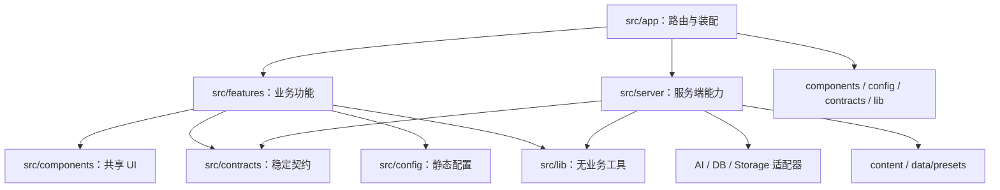

# 项目文件树安排

> 适用项目：AI 基础教育公益网站
> 文档状态：V0.1 开发结构基线
> 更新日期：2026-07-26
> 目标：用清晰的目录边界降低两人并行开发时的合并冲突，保证内容、UI、业务逻辑和未来服务端能力可独立演进。

相关文档：

- [产品与技术方案](../../方案/AI基础教育公益网站搭建方案_V0.2.docx)
- [两人协作与分阶段部署方案](../项目协作/两人协作与分阶段部署方案_V0.2.md)
- [项目开发环境要求](../环境要求/环境要求.md)

文档边界：产品范围与页面要求以“产品与技术方案”为准，分支、PR 和部署流程以“两人协作与分阶段部署方案”为准，文件落位、模块边界和导入方向以本文为准。旧协作方案第 5 节的根级 `app/` 目录示例不再作为实施依据。

## 0. 结论先行

1. 项目继续保持一个 Next.js 应用，当前不拆 monorepo、独立后端仓库或组件包。
2. `src/app/` 只负责路由、metadata、页面状态和模块装配，不堆放大量业务逻辑。
3. 业务按功能放入 `src/features/`；AI 创作实验室和 AI 学习实验室默认互不导入。
4. 课程正文和教学资产放入根目录 `content/`，运行时预置数据放入 `data/presets/`，不与页面排版混在一起。
5. 路由、设计 token、内容 schema、preset schema、MDX 白名单和 API 结构都是公共契约，修改前必须两人确认。
6. 只在出现第二个稳定消费者时抽取共享能力，不预先创建万能 `common/`、`misc/` 或 `utils.ts`。
7. 下文是目标结构，不要一次性提交全部空目录；当第一个真实功能需要时再创建对应目录。

## 1. 当前基线

当前仓库仍是最小 Next.js 16 骨架：

```text
ai-education-website/
├── src/app/
│   ├── favicon.ico
│   ├── globals.css
│   ├── layout.tsx
│   └── page.tsx
├── public/
├── docs/
├── package.json
├── package-lock.json
├── next.config.ts
└── tsconfig.json
```

当前尚未安装 MDX、Vitest 或 Playwright，也没有 `test`、独立 `typecheck` 脚本和 CI workflow。本文标注为“规划”或“后续”的目录不代表已经实现。

## 2. 目标文件树

阶段标记：

- `V0.1`：静态课程、本地互动和双项目预置体验需要。
- `V0.5`：受限 AI API、账号、数据库和私有存储阶段再建立。
- `V1.0`：公测部署、监控、备份和运维需要。

```text
ai-education-website/
├── src/
│   ├── app/                                  # Next.js App Router，只做路由与装配
│   │   ├── layout.tsx                       # 唯一根布局
│   │   ├── globals.css                      # 全局样式唯一入口
│   │   ├── favicon.ico
│   │   ├── not-found.tsx                    # V0.1：全局 404
│   │   ├── robots.ts                        # 共享预览/公测时增加
│   │   ├── sitemap.ts                       # 公开课程发布时增加
│   │   ├── (site)/                          # Route Group，不进入 URL
│   │   │   ├── layout.tsx                   # 公共顶栏、页脚和内容容器
│   │   │   ├── page.tsx                      # /
│   │   │   ├── learn/page.tsx                # /learn
│   │   │   ├── courses/page.tsx              # /courses
│   │   │   ├── courses/[chapter]/[lesson]/
│   │   │   │   ├── page.tsx                  # 课程阅读页
│   │   │   │   ├── loading.tsx               # 确有异步加载时再建
│   │   │   │   └── not-found.tsx             # 章节或课程不存在
│   │   │   ├── projects/create/page.tsx       # /projects/create
│   │   │   ├── projects/create/[slug]/page.tsx
│   │   │   ├── projects/learn/page.tsx        # /projects/learn
│   │   │   ├── projects/learn/[slug]/page.tsx
│   │   │   ├── works/page.tsx                 # /works
│   │   │   ├── works/[slug]/page.tsx
│   │   │   ├── parents/page.tsx               # /parents
│   │   │   ├── about/page.tsx
│   │   │   ├── privacy/page.tsx
│   │   │   ├── terms/page.tsx
│   │   │   └── safety/page.tsx
│   │   └── api/v1/                          # V0.5：证明真实需求后再建
│   │       ├── ai/explain/route.ts
│   │       ├── ai/notes/route.ts
│   │       ├── ai/quiz/route.ts
│   │       └── ai/project-feedback/route.ts
│   │
│   ├── components/                           # 稳定、跨功能的共享组件
│   │   ├── ui/                               # Button、Input、Dialog 等无业务原语
│   │   ├── layout/                           # Header、Footer、Sidebar、Breadcrumb
│   │   └── content/                          # KnowledgeCard、QuickQuiz 等 MDX 白名单组件
│   │
│   ├── features/                             # 按业务功能分区
│   │   ├── learning-path/
│   │   ├── course-reader/
│   │   ├── course-interactions/
│   │   ├── creation-lab/
│   │   │   ├── components/
│   │   │   ├── model/
│   │   │   ├── storage/
│   │   │   └── public.ts
│   │   ├── study-lab/
│   │   │   ├── components/
│   │   │   ├── model/
│   │   │   ├── storage/
│   │   │   └── public.ts
│   │   ├── lab-shared/                       # 按需：只放真正复用的实验室能力
│   │   ├── progress/
│   │   └── works/
│   │
│   ├── contracts/                           # 稳定类型和运行时 schema
│   │   ├── course.ts
│   │   ├── creation-lab.ts
│   │   ├── study-lab.ts
│   │   ├── progress.ts
│   │   └── ai.ts                             # V0.5：API 请求与响应
│   │
│   ├── config/                              # 不含密钥的静态配置
│   │   ├── site.ts
│   │   ├── routes.ts
│   │   └── navigation.ts
│   │
│   ├── lib/                                 # 无业务语义的纯函数与小工具
│   │   ├── browser/
│   │   └── shared/
│   │
│   ├── server/                              # 只能被 Server Component/Route Handler 使用
│   │   ├── content/                          # V0.1：MDX、preset 读取与校验
│   │   ├── env/                              # V0.5：环境变量校验
│   │   ├── ai/                               # V0.5：网关、预算、安全与供应商适配
│   │   ├── auth/                             # V0.5：鉴权与监护人同意
│   │   ├── dal/                              # V0.5：数据访问边界
│   │   ├── db/                               # V0.5：数据库连接
│   │   ├── storage/                          # V0.5：私有对象存储
│   │   └── observability/                    # V1.0：日志、成本和安全事件
│   │
│   ├── styles/
│   │   ├── tokens.css                       # 颜色、字号、间距等唯一来源
│   │   ├── base.css                         # 基础元素和可访问性默认值
│   │   └── prose.css                        # 课程正文排版
│   └── mdx-components.tsx                  # Next.js MDX 全局白名单适配器
│
├── content/                                  # 人工编写和审校的内容资产
│   ├── learning-path.json                    # 8 阶段路线和顺序
│   ├── courses/
│   │   ├── ai-basics/
│   │   │   ├── chapter.json
│   │   │   ├── what-is-ai.mdx
│   │   │   └── how-machines-learn.mdx
│   │   └── ...                             # 一课一文件
│   ├── projects/
│   │   ├── creation/
│   │   └── study/
│   ├── parents/
│   └── works/                               # 只放已授权、已审核的作品资料
│
├── data/presets/                             # 结构化预置体验数据
│   ├── interactions/
│   ├── creation-lab/
│   │   └── word-quiz/
│   │       ├── preset.json
│   │       └── versions/
│   └── study-lab/
│       └── buoyancy/
│           └── preset.json
│
├── public/                                   # 可被公网直接请求的静态资源
│   └── images/
│       ├── brand/
│       ├── courses/
│       ├── projects/
│       └── works/
│
├── tests/                                    # 规划：跨模块测试
│   ├── content/                              # 元数据、重复 slug、内链与 MDX 白名单
│   ├── integration/                          # 多模块集成
│   ├── architecture/                         # 导入边界和 server/client 边界
│   ├── e2e/                                  # Playwright 关键学习路径
│   └── fixtures/                             # 仅跨模块共享的测试数据
│
├── scripts/                                  # 内容校验、搜索索引和维护脚本
│   ├── validate-content.mjs
│   └── build-search-index.mjs
│
├── database/                                 # V0.5：按最终 ORM 和数据库调整
│   ├── migrations/
│   └── seeds/
│
├── infra/                                    # V1.0：部署、监控、备份与回滚
├── docs/                                     # 方案、协作原则和决策记录
├── .github/                                  # Issue/PR 模板与 CI workflow
├── .env.example                              # V0.5：只保留变量名
├── vitest.config.ts                          # 规划：安装 Vitest 时再建
├── playwright.config.ts                      # 规划：安装 Playwright 时再建
├── next.config.ts
├── package.json
├── package-lock.json
└── tsconfig.json
```

## 3. 各层职责与所有权

目录所有权用于明确主责与审核路由，不代表只有主责人能修改。

| 目录或区域 | 主要职责 | 主责 | 必须审核 |
| --- | --- | --- | --- |
| `src/app/` | 路由、layout、metadata、加载/错误状态和页面装配 | 成员 A | 成员 B 验收用户路径与文案 |
| `src/components/` | 设计系统、公共布局和无业务原语 | 成员 A | 成员 B 验收适龄性与可读性 |
| `src/features/course-*` | 课程阅读、交互与进度能力 | 成员 A | 成员 B 验收教学逻辑 |
| `src/features/creation-lab/` | 创作项目流程、预览和安全边界 | 成员 A | 成员 B 验收任务与示例 |
| `src/features/study-lab/` | 学习项目界面与输出组装 | 成员 A 主实现，成员 B 主流程 | 双方 |
| `content/` | 课程、项目任务单、家长内容和审核作品 | 成员 B | 成员 A 检查 schema 与渲染 |
| `data/presets/` | 预置体验的教学数据和期望结果 | 成员 B 主内容，成员 A 主结构 | 双方 |
| `src/contracts/` | 内容、preset、进度和 API 契约 | 共享热点 | 双方批准 |
| `src/server/` | 内容加载、密钥、AI、数据库和存储边界 | 成员 A | 成员 B 验收数据最小化与产品降级 |
| `tests/` | 跨模块、内容、架构和端到端测试 | 跟随被测模块 | 另一位成员 |
| `docs/` | 方案、决策、环境和协作规则 | 按主题分工 | 影响公共规则时双方批准 |

## 4. 模块依赖方向

`A -> B` 表示 A 可以导入 B，不代表 B 可以反向导入 A。



必须遵守：

1. `page.tsx`、`layout.tsx` 和 `route.ts` 保持简短，只做参数解析、metadata、数据读取和功能装配。
2. `src/components/ui/` 不导入 `features`、课程内容或服务端代码。
3. `src/features/` 默认不互相导入内部文件。确需协作时只从对方的 `public.ts` 导入稳定能力。
4. `public.ts` 只显式导出已承诺稳定的类型和组件，不使用无差别 `export *`。
5. 跨目录导入使用 `@/` 别名，不使用多层 `../../../`，不绕过模块公开入口做 deep import。
6. 带 `"use client"` 的文件不得导入 `src/server/`、密钥、数据库客户端或模型供应商 SDK。
7. `src/server/` 入口显式使用 `server-only`。Server Component 直接调用服务层，不通过 HTTP 调用自己的 Route Handler。
8. `src/lib/` 只放纯函数和无业务语义工具。只服务一个功能的辅助代码留在对应 feature 内。
9. 不允许循环依赖。未来在 `tests/architecture/` 或 ESLint 中将这些规则自动化。

## 5. 内容、UI 与数据解耦

### 5.1 课程内容

- 每课一个 `.mdx` 文件，使用统一 frontmatter。
- 课程树、搜索索引和上一篇/下一篇从元数据生成，不另外维护一个多人频繁修改的巨大目录 JSON。
- MDX 只承载元数据、正文、题目 ID、引用和资源标识；不写页面布局、散落 CSS、密钥、网络请求或持久化逻辑。
- `src/mdx-components.tsx` 是 Next.js 全局薄适配层，只映射 `src/components/content/` 中登记的白名单组件。
- 内容负责人不直接从 MDX 导入 feature 内部实现。新教学组件先经独立接口 PR 登记，再在课程中使用。
- `src/server/content/` 负责读取、校验和返回稳定的 typed model。未来 Markdown/MDX 迁移到 CMS 时，页面和课程组件不需要改变。
- 除内容校验脚本外，只允许 `src/server/content/` 直接读取根目录 `content/` 和 `data/presets/`，其他模块使用经校验的 typed model。

### 5.2 预置体验数据

- 预置数据按实验室和项目 slug 拆分，不合并成单一大 JSON。
- `data/presets/creation-lab/` 和 `data/presets/study-lab/` 共用 schema 能力，但不互相读取业务数据。
- 静态 preset 与未来 API 响应复用 `src/contracts/` 中的同一 schema，前端 feature 只替换数据源，不重写 UI 流程。
- 生产 preset 不兼任测试 fixture；测试数据放在对应模块的 `__fixtures__/` 或 `tests/fixtures/`。
- 可执行 HTML 案例不作为同源 `.html` 直接放入 `public/`。首版保存为 JSON 字符串或 `.html.txt`，再由受限 sandboxed iframe 加载。

### 5.3 共享 UI

- `components/ui/` 只接收通用 props，不硬编码某一课、某个年级或某个实验室的文案。
- `components/layout/` 只管全站框架，课程阅读器的业务状态保留在 `features/course-reader/`。
- `styles/tokens.css` 是颜色、字号、间距、圆角和容器尺寸的唯一来源；`globals.css` 只导入样式层并定义极少的全局规则。
- 组件负责响应式、可访问性、加载、空数据、错误和完成状态，内容文件不重复实现这些能力。

## 6. 公共契约与变更流程

以下内容一旦有第一个消费者，即视为已冻结公共契约：

- `src/config/routes.ts` 中的 URL、参数名、slug 和重定向规则；
- `src/config/navigation.ts` 中的一级导航结构；
- `src/styles/tokens.css` 中的 token 名称；
- `src/contracts/` 中的内容、preset、进度和 API schema；
- feature `public.ts` 导出的类型、组件和函数；
- `src/mdx-components.tsx` 中允许内容作者使用的组件名和 props；
- `localStorage` key、数据版本和迁移规则；
- 环境变量名、API 路径和请求/响应字段。

变更流程：

1. 先建 Issue，列出当前消费者、兼容方式和删除时间。
2. 优先新增可选字段或新接口，保留旧接口，避免一次同时修改多个功能。
3. 公共契约使用独立的小型“接口 PR”先合并，再让两人在各自功能分支中更新消费者。
4. 完成全部迁移后，再在另一个 PR 删除旧接口。
5. 路由、公开 slug 和资源地址变更必须保留重定向；数据库阶段采用“扩展 -> 迁移 -> 收缩”，不改写已执行的 migration。

## 7. 两人并行开发边界

### 7.1 可以并行的工作

| 成员 A | 成员 B | 并行前提 |
| --- | --- | --- |
| 课程阅读器和公共组件 | 独立课程 MDX | frontmatter schema 与 MDX 组件白名单已冻结 |
| `creation-lab/` 技术实现 | 创作项目任务单与 preset | creation-lab schema 已冻结 |
| `study-lab/` 界面和导出 | 浮力案例、诊断问题和资料包 | study-lab schema 已冻结 |
| 不同 feature 目录 | 不同内容/preset 目录 | 不同时修改共享热点 |
| 代码和测试 | 文案、资料核对和验收 | PR 中明确各自负责的文件 |

### 7.2 必须串行的高冲突热点

以下文件同一时间只安排一位修改者：

- `package.json` 和 `package-lock.json`；
- `next.config.ts`、`tsconfig.json`、ESLint 配置和根级环境文件；
- `src/app/layout.tsx` 和 `src/app/globals.css`；
- `src/styles/tokens.css` 和 `src/components/ui/`；
- `src/config/routes.ts` 和 `src/config/navigation.ts`；
- `src/contracts/` 下的 schema；
- `src/mdx-components.tsx`；
- GitHub Actions、部署配置和未来数据库 migration。

开始修改前，在 Issue 中声明会触及的热点文件。如果两个任务都需要同一热点，先合并一个独立的接口/配置 PR，再继续并行。

### 7.3 分支与 PR 范围

- 默认使用 `main + Issue 短期分支`，不建立成员 A/B 的长期个人分支。
- 一个 PR 尽量只改一个 feature 或一类内容；跨模块时将契约变更与功能实现拆开。
- PR 描述必须列出修改目录、公共契约影响、验证命令、桌面/移动端截图和待审核内容。
- 直接推送 `main` 只作为双方明确同意的纯文档初始化或紧急修复例外，不能成为常规开发方式。

## 8. 测试文件放置

当前测试工具尚未安装。引入 Vitest 和 Playwright 后遵守：

- 纯函数、模型和同步组件单元测试与源文件同目录，命名为 `*.test.ts` 或 `*.test.tsx`。
- 模块自用 fixture 放在模块内 `__fixtures__/`；只有多个模块共享的测试数据才放入 `tests/fixtures/`。
- `tests/content/` 校验 frontmatter、重复 slug、资源引用、内链和 MDX 白名单。
- `tests/integration/` 测试跨 feature 或加载器与内容的组合。
- `tests/architecture/` 检查跨模块导入、循环依赖与 Client/Server 边界。
- `tests/e2e/` 使用 Playwright 验证首页 -> 学习路线 -> 课程 -> 互动 -> 下一课，以及两个实验室的完整流程。
- 异步 Server Component 优先通过端到端测试验证，不强行用组件单测试覆盖。
- 测试所有权跟随源码和内容所有权；修改模块时同步修改对应测试。

## 9. 命名与文件规则

- URL、代码目录、静态资源和 slug 使用小写英文 `kebab-case`；中文目录只用于 `docs/`。
- React 组件文件使用 `PascalCase.tsx`，非组件模块使用 `kebab-case.ts`。
- 动态路由参数名保持稳定，统一使用 `[slug]`、`[chapter]`、`[lesson]` 等表意名称。
- 课程 slug、preset ID、测验 ID 和 `localStorage` key 发布后不随意重命名。
- 文件按职责拆分，不按人员命名；禁止 `member-a/`、`member-b/`、`temp/` 和 `final-v2/` 这类目录。
- 不为单个文件建立没有分组价值的空壳目录；当模块拥有组件、模型或测试等多种职责时再分层。

## 10. 分阶段落地顺序

### 10.1 结构基线

1. 冻结 `src/config/routes.ts`、`src/styles/tokens.css`、课程 schema 和 MDX 白名单的位置与命名。
2. 创建 `.github/` 中的 Issue/PR 模板与基础 CI。
3. 建立黄金样板课所需的最少目录，不创建 V0.5/V1.0 空壳。

### 10.2 V0.1 静态原型

1. 建立 `content/courses/`、课程契约和 `src/server/content/`。
2. 建立 `components/ui/`、`components/layout/`、`styles/` 和课程阅读 feature。
3. 完成一篇黄金样板课后，再允许内容与 UI 大量并行。
4. 分别建立 `creation-lab/`、`study-lab/` 与各自 preset，保持零 API 可用。
5. 建立内容校验、基础单元测试和关键路径端到端测试。

### 10.3 V0.5 受限 API 试点

1. 在实际需求成立后再建 `app/api/v1/`、`server/ai/`、`server/auth/`、`server/dal/`、`database/` 和私有存储适配。
2. Route Handler 只做鉴权、输入校验、限流和调用服务，业务逻辑保留在服务层。
3. 模型、数据库和存储供应商通过 adapter 隔离，feature 不导入供应商 SDK。

### 10.4 V1.0 公益公测

1. 增加 `infra/`、监控、审计、备份和回滚文档。
2. 在真实运行时要求成立前，不预先锁定 Docker、Nginx 或某一云厂商目录结构。

## 11. PR 自检清单

- [ ] 新文件放在拥有该职责的最近模块内，而不是万能共享目录。
- [ ] `page.tsx`、`layout.tsx` 和 `route.ts` 没有堆积可复用业务逻辑。
- [ ] 没有新增反向依赖、deep import、循环依赖或 Client -> Server 导入。
- [ ] 共享抽象至少有两个真实消费者，命名不含 `common`、`misc` 或人员名。
- [ ] 内容、样式、预置数据和业务逻辑没有混在同一文件。
- [ ] 公共契约变更已单独说明影响面、兼容方案和迁移步骤。
- [ ] 新增环境变量已同步 `.env.example` 与环境文档，且没有提交密钥。
- [ ] 修改的模块已同步更新单元、内容、契约或端到端测试。
- [ ] 本地 `npm run lint` 和 `npm run build` 通过；测试脚本接入后一并通过。
- [ ] PR 没有带入与本任务无关的格式化、锁文件或目录搬迁。
